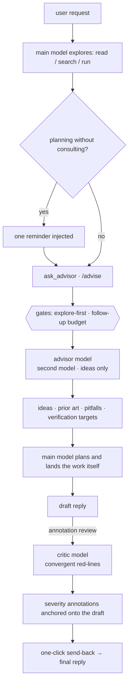

<p align="center">
  
</p>

<p align="center">
  <a href="https://www.npmjs.com/package/dsh-ciel"></a>
  <a href="https://www.npmjs.com/package/dsh-ciel"></a>
  <a href="https://github.com/higekibaka/dsh-ciel/actions/workflows/ci.yml"></a>
  <a href="./LICENSE"></a>
</p>

<p align="center"><b>English</b> | <a href="./README.md">中文</a></p>

# dsh-ciel（夏尔 Ciel）

A pre-planning advisor and a convergent critic for
[DeepSeek Harness](https://github.com/deepseek-ai/deepseek-harness) (DSH) —
a second, knowledge-rich model that offers directions, prior art, pitfalls,
and verification checklists **before** the main model commits to a plan.
Ideas, never steps. Named after Ciel, the in-head advisor from *That Time I
Got Reincarnated as a Slime*.

The value is not "the advisor is smarter" — it is **distribution diversity**
plus a forced separation of the exploring and executing cognitive roles. By
constraining the advisor to ideas only, understanding and landing the work
stays with the main model. Full argument: [docs/design.md](docs/design.md).

## How it flows



The two pipelines are deliberately **role-separated**:

```text
  divergent (pre-plan)                  convergent (post-draft)
  ────────────────────                  ───────────────────────
  advisor pipeline                      critic pipeline
  ask_advisor · /advise                 annotation review
  ideas · prior art · pitfalls          red-lines · severity tiers
  widens the solution space             narrows the risk surface
  directions, never steps               falsifies output, never
                                        the author's reasoning
```

## What you get

- **`ask_advisor` tool** — one synchronous consultation with the advisor
  model, gated by an explore-first protocol and a bounded follow-up budget.
- **Guidance prompt section** — the consultation protocol injected into the
  system prompt (toggleable).
- **Annotation review (批注评审)** — a per-reply button that runs the
  convergent critic (default `google/gemini-3.8-flash`) over the draft and
  anchors red-line annotations onto the reply text, with severity
  underlines, badges, and a full review panel. Reviews persist across
  restarts.
- **`/advise` command** — human-triggered consultation with auto-assembled
  context; the result card is shown inline and the main model is notified
  automatically.
- **Settings card** — Settings → Plugins → 插件配置 → 夏尔 Ciel, hot-applied
  without restart.

<p align="center">
  
</p>
<p align="center">
  
</p>
<p align="center">
  <picture>
    <source media="(prefers-color-scheme: dark)" srcset="https://github.com/higekibaka/dsh-ciel/raw/main/docs/images/ciel-card-groups-dark.png">
    
  </picture>
  <picture>
    <source media="(prefers-color-scheme: dark)" srcset="https://github.com/higekibaka/dsh-ciel/raw/main/docs/images/ciel-card-critic-dark.png">
    
  </picture>
</p>

## Install

```sh
dsh plugin --profile web add dsh-ciel
```

Restart DSH. The plugin activates globally: the `ask_advisor` tool and the
guidance section reach every agent in every preset; the settings card
appears under **Settings → Plugins → 插件配置**.

> Upgrading from `dsh-advisor` (≤ 0.10.x)? Your `advisor:` section in
> `settings.yaml` is copied into the new `ciel` namespace automatically on
> first boot. The legacy section is left in place — remove it by hand
> whenever you like.

## Configuration

All fields live in the `ciel` settings namespace (the settings card or the
`ciel:` section of `settings.yaml`):

| Field | Default | Description |
|---|---|---|
| `provider` | `kimi-coding` | Advisor provider route (must be registered under Settings → Models) |
| `model` | `kimi-for-coding` | Advisor model id; cross-family diversity pays most |
| `reasoningEffort` | `provider` | Thinking depth pinned onto each advisor request; `provider` follows the provider default |
| `maxTokens` | `4096` | Advisor reply length cap (256–32768) |
| `maxCallsPerTurn` | `3` | Consultations per turn: 1 divergence + follow-up budget |
| `requireExploration` | `true` | First consultation requires a prior non-advisor tool call |
| `enforceFollowupGap` | `true` | Follow-ups require independent work in between |
| `planReminderEnabled` | `true` | One reminder when planning starts unconsulted |
| `guidanceEnabled` | `true` | Inject the consultation protocol into the system prompt |
| `criticProvider` | `google` | Critic provider route (independent of the advisor pipeline) |
| `criticModel` | `gemini-3.8-flash` | Critic model id |
| `criticEffort` | `medium` | Thinking depth pinned onto critic requests; `provider` also accepted |
| `enabled` | `true` | Allow Ciel model calls and feedback; turning off cancels its in-flight consultations/reviews |
| `advisorTimeoutSeconds` | `180` | Total deadline per advisor or `/advise` call, 10–600 seconds |
| `criticExploreEnabled` | `true` | Separate nomination and read-only verification phases |
| `criticExploreBudget` | `5` | Allowed tool executions, 0–10; 0 disables exploration, NOT model calls |
| `criticTimeoutSeconds` | `180` | Total deadline across all review phases, 10–600 seconds |
| `criticMaxRequests` | `16` | Review model-step request cap, 2–32; provider-internal retries remain DSH-owned |
| `criticMaxTokens` | `16384` | Per-request output cap, 256–32768; nomination capped at 4096, salvage at 8192 |

## Review results and spending

Nomination sees only the request and draft; author evidence and advisor targets arrive during verification. A valid empty list means “not independently verified”, not a factual certification. Malformed responses fail explicitly. Unchecked suspects, missing/conflicting outcomes and salvaged results remain visibly incomplete. Host-assigned suspect ids bind accepted annotations to selected defect outcomes; the host computes counts and the card summary, rejecting annotations on cleared or unchecked ids. Citations are model-authored evidence references, not programmatically verified truth; the author should check them before acting on feedback.

One review may run per session. Its Stop control cancels every phase. A single tool-free salvage is allowed only after a tool-budget abort with a cited partial dossier; cancellation, timeout, network/auth failures and request-limit exhaustion do not initiate salvage.

**Tool counts are not a money budget.** Both phases, follow-up generations after tools and repeated input context incur model usage. Output limits are per request, not an aggregate token cap; DSH provider retries may add attempts. Cancellation cannot refund consumed tokens. Use `enabled: false` to stop Ciel calls, not merely a zero exploration budget; previously delivered feedback turns running in the author are not cancelled by this switch.

## Compatibility

- Safe model calls require DSH `tools.guard()`, keyed `settings.plugin.item`, and Typert Remote; the real execution chain is verified on **0.1.3-alpha.1**. Older runtimes without the guard refuse calls explicitly instead of silently running unmetered. Stored legacy reviews remain readable.
- Node.js ≥ 22.
- Designed to coexist with [omdsh-dev/dsh-advisor](https://github.com/omdsh-dev/dsh-advisor):
  the settings namespace moved to `ciel` in 0.11.0 so both plugins can be
  installed side by side.

## Development

**A separate profile or port does not isolate session history.** Test servers sharing `DSH_HOME` still populate the main GUI's session store and Ungrouped list. Browser A/B requires the test server itself to use a separate `DSH_HOME`; setting it only on the driver is not isolation. Do not run browser evaluations against the main GUI.

Prefer `verify-runtime.mjs` below: it creates and cleans up a temporary `DSH_HOME`, without leaving sidebar test sessions. DSH already hides Ciel's subagent-origin child sessions; ordinary user conversations must not be hidden alongside them.

Run keyless regression tests with `node --test` inside `plugin/`. Replay the real DSH agent/tool chain without starting Web:

```sh
DSH_CHECKOUT=/path/to/deepseek-harness node scripts/verify-runtime.mjs
```

For explicitly authorized live tests, add `--live` and supply `CIEL_ALLOW_PAID_TESTS=1` and `DEEPSEEK_API_KEY` through the environment. The driver pins `deepseek-v4-flash-vision-exp` and rejects other network destinations. Never place keys in arguments or source.

The browser A/B driver requires explicit `CIEL_ALLOW_PAID_TESTS=1`, `CIEL_AB_MODEL`, and `CIEL_AB_CRITIC_PROVIDER` (optionally `CIEL_AB_CRITIC_MODEL`), and refuses ambiguous model/message identity. It regenerates author drafts, so its results are diagnostic observations, not a controlled model ranking; prefer fixed-fixture regressions.

> After a local `pnpm install` inside `plugin/`, run
> `scripts/relink-dev.sh` once: the two `@deepseek-ai/*` devDependencies
> (cordis, typert-protocol) must stay symlinked to the profile's shared
> copies — a real second copy carries its own registry state and breaks the
> linked plugin. npm-installed deployments are unaffected (devDependencies
> are never installed for consumers).

## License

[MIT](./LICENSE) © hgk
