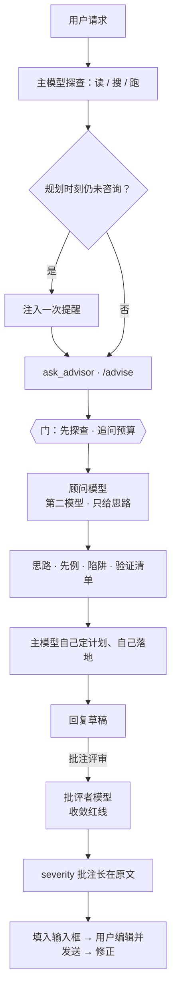

<p align="center">
  
</p>

<p align="center">
  <a href="https://www.npmjs.com/package/dsh-ciel"></a>
  <a href="https://www.npmjs.com/package/dsh-ciel"></a>
  <a href="https://github.com/higekibaka/dsh-ciel/actions/workflows/ci.yml"></a>
  <a href="./LICENSE"></a>
</p>

<p align="center"><a href="./README.en.md">English</a> | <b>中文</b></p>

# dsh-ciel（夏尔）

[DeepSeek Harness](https://github.com/deepseek-ai/deepseek-harness)（DSH）的**规划前顾问 + 收敛批评者**：在主模型制定计划之前，由一个知识分布不同的顾问模型提供思路、领域知识与陷阱清单——只给思路，不给步骤；另附每条助手回复的「批注评审」按钮，由批评者模型（默认 `google/gemini-3.8-flash`）对草案做红线批注。命名灵感：《关于我转生变成史莱姆这档事》中主角的脑内参谋大贤者夏尔。

顾问模式的价值不在于"顾问更聪明"，而在于**引入分布多样性 + 分离探索与执行两种认知角色**，并用"只给思路"的约束把理解和落地的工作强制留在主模型身上。完整论证见 [docs/design.md](docs/design.md)。

## 工作流程



两条管道刻意**角色分离**：

```text
  发散（规划前）                    收敛（成稿后）
  ─────────────                    ─────────────
  顾问管道                          批评者管道
  ask_advisor · /advise            批注评审
  思路 · 先例 · 陷阱 · 验证清单      红线批注 · severity 分级
  只给方向，不下场                  证伪输出，不复盘心路
  开阔主模型的解空间                收窄成稿的风险面
```

## 功能

- **`ask_advisor` 工具**——一次同步咨询：思路、先例、陷阱、验证清单；受「先探查后咨询」门与追问预算约束。
- **指导 prompt section**——咨询协议注入系统提示词（可开关）。
- **批注评审**——每条助手回复操作区的「批注评审」按钮：批评者对草案做收敛型红线评审，批注以 severity 波浪下划线 + 角标长在原文上，另有完整评审面板；评审记录持久化、跨重启水合。
- **原生右侧栏资源**——评审、历史证据与顾问记录注册为三个 `dsh-resource://` 资源与标签页；聊天保留摘要与角标，侧栏显示完整批注、引用与顾问条目。资源读取一次即结束，不后台监听、不轮询、不调用模型；失败时不显示上一次成功值。
- **`/advise` 命令**——人类触发咨询：上下文自动装配、结果卡片、自动知会主模型。
- **独立设置页**——设置左侧 → 夏尔 Ciel，位于 Agent 预设之后；采用 DSH 原生开关与只读状态标签，点击保存后热生效。切换页面保留草稿，不再在插件配置中重复编辑。

> 下方截图是旧版设置卡片与顾问卡片。当前版本使用左侧独立设置入口与原生右侧栏资源；后者尚无已发布截图，本文不代拟界面。

<p align="center">
  
</p>
<p align="center">
  
</p>
<p align="center">
  <picture>
    <source media="(prefers-color-scheme: dark)" srcset="https://github.com/higekibaka/dsh-ciel/raw/main/docs/images/ciel-card-groups-dark.png">
    
  </picture>
  <picture>
    <source media="(prefers-color-scheme: dark)" srcset="https://github.com/higekibaka/dsh-ciel/raw/main/docs/images/ciel-card-critic-dark.png">
    
  </picture>
</p>

## 安装

```sh
dsh plugin --profile web add dsh-ciel
```

重启 DSH 后生效：工具与指导 section 对所有 preset 全局可用，设置出现在 **设置 → 夏尔 Ciel** 的独立页面。

> 从 dsh-advisor（≤ 0.10.x）升级？`settings.yaml` 里的 `advisor:` 节会在首次启动时**自动迁入**新的 `ciel` 命名空间；旧节保留不删，可随时手工移除。

## 配置项（`ciel` 命名空间）

| 字段 | 默认 | 说明 |
|---|---|---|
| `provider` | `kimi-coding` | 顾问提供方路由（须已在设置 → 模型 注册） |
| `model` | `kimi-for-coding` | 顾问模型 id；跨家族模型多样性收益更大 |
| `reasoningEffort` | `provider` | 注入每次咨询的思考深度；`provider` 跟随提供方默认 |
| `maxTokens` | `4096` | 顾问单次输出上限（256–32768） |
| `maxCallsPerTurn` | `3` | 每轮咨询额度：1 次发散 + 追问预算 |
| `requireExploration` | `true` | 首次咨询前要求先探查 |
| `enforceFollowupGap` | `true` | 追问之间要求独立工作 |
| `planReminderEnabled` | `true` | 规划时刻提醒 |
| `guidanceEnabled` | `true` | 注入使用协议到系统提示词 |
| `criticProvider` | `google` | 批评者提供方路由（独立于顾问管道） |
| `criticModel` | `gemini-3.8-flash` | 批评者模型 id |
| `criticEffort` | `medium` | 注入评审请求的思考深度；亦接受 `provider` |
| `enabled` | `true` | 本插件调用总开关；关闭取消在途顾问/评审，并禁止新调用与新回传 |
| `advisorTimeoutSeconds` | `180` | 单次顾问或 `/advise` 总时限，10–600 秒 |
| `criticExploreEnabled` | `true` | 两阶段评审：先存疑，再只读核实 |
| `criticTimeoutSeconds` | `180` | 评审唯一的执行预算：准备资料、存疑、核实共用总时限，10–600 秒 |
| `criticMaxTokens` | `16384` | 单条模型响应的大小保护，256–32768；存疑最多 4096，不限制模型请求次数 |

## 评审结果与费用

批注按钮现在是“填入输入框”：追加到对应会话草稿，保留原文、引用卡片和附件，由你编辑确认后手动发送。填入不算已发送；清空草稿后可以重新填入。准备期间切换会话或修改输入时拒绝迟到写入，不覆盖、不自动发送；缺少新版 DSH 输入接口时明确失败，不退回自动回传。

0.17.0 起评审只限总时间，默认180秒；查询与模型请求次数只统计，不再因为达到某个次数而停止，也不据此截取疑点。资料准备和两个阶段共用同一个截止时间，不重新计时。旧 `criticExploreBudget` / `criticMaxRequests` 设置仍可加载但不生效（包括旧值0）；是否查文件只看 `criticExploreEnabled`。本轮没有工具记录、只找到旧报告或不同套件，均不能直接证明测试未发生；证据不足应为未查，不据此指控造假。

存疑阶段只看用户请求和草稿，核实阶段才收到作者工具证据及顾问清单。合法空清单显示“未核实”，格式失败显示错误；未查完、逐项结果缺失/冲突以及旧版抢救记录显示“不完整”，不作为完整通过。宿主分配疑点编号，按逐项结果自己计数、生成总评；已排除或未查项的提醒批注会被剔除，规则见 [评审契约](docs/review-contract.md)。证据字段是模型引用，不代表程序已经验证引用内容为真；回传后作者仍应核对，而不是盲目修改。

每个会话同时允许一项评审；评审中可点“停止”。到总时限即中断当前工作并记录未完成/错误，不追加模型整理、不自动延时重试。正常完成或无法继续的错误也可提前结束评审；不是一定要运行到时限。0.18.0 起核实阶段只呈现原生保留的 `run_code`：批评者程序在 Ciel 私有的 worker + QuickJS/WASM 中执行，只能通过 `JSON.parse(await tools.read/grep/glob(...))` 查询评审开始时的不可变内存副本；`grep` 是字面量搜索，程序只接受 TypeScript 可擦除语法，缺少能力时明确失败而不回退普通文件工具。详见 [受限 PTC 评审交接](docs/ptc-review.md)。

**时间上限不是金额上限。** 两阶段及工具后的继续生成都会请求模型，输入上下文也会计费；输出上限是每请求上限，不是整轮总额，DSH 提供方还可能重试。停止不会退还已经消耗的 tokens。要禁止 Ciel 调用请关闭 `enabled`；要关闭文件核查用 `criticExploreEnabled: false`（仍会调用模型）；此前已回传给主模型的修复轮次不归此开关取消。

独立设置页把总开关、常用设置和高级设置分开；所有修改在点击“保存”后以同一修订号原子提交。草稿在切换页面时保留，刷新页面不自动保存；配置在别处有更新时拒绝覆盖。“当前已启用”显示保存值，“待保存”标记草稿预览。顾问和评审卡片记录本次模型，历史缺失不会用当前配置补猜。

文件核查只访问本次受限源码副本，默认来自当前会话工作目录；高级设置 `criticAdditionalRoots`（默认 `[]`）可追加明确允许的源码目录。普通工具输出保留，疑似凭据或作者过程资料会被扣留并标明未完整核实。内容检测不是识别所有秘密的保证，详见 [读取隔离与模型标识](docs/read-isolation.md)。

**受限 PTC 不等于通用沙箱。** 批评者程序没有环境 Node 全局，不能直接读实时文件、起进程、联网或读会话；根 `codeRuntime` 不变，能力缺失时工具化阶段失败而不回退。私有注册表沿用 DSH 嵌套调度与日志格式，由 Ciel 守卫控制范围与时限；隔离的私有 `tools/result` 事件不会进入根观察者，因此并非所有全局策略插件都作用于该子会话。程序收到的是宿主裁剪后的回执，模型上下文只看到程序打印/返回的摘要与必要片段——不要把「程序读到」当成「模型看到全部文件」。DSH 原生子会话日志仍可能保留每次嵌套查询，Ciel 的片段/记录限额不是全局无痕承诺。

## 记录与证据存储

> 以下限制针对 Ciel 额外记录。DSH 本身仍可能保存顾问/评审子会话日志；清理 Ciel 旧记录不删除这些原生会话，也不代表全局无痕。

新版记录只写入版本化数据根 `$DSH_HOME/ciel/v1/<kind>/<sessionId>/<hash(id)>.json`：`kind` 为 `reviews` / `evidence` / `advice`（保留 `calls` / `feedback`）。每条记录封装 `schemaVersion`、`kind`、`sessionId`、`id` 与 `value`，以随机临时文件 `wx` 写入后原子重命名替换同键记录；目录 0700、文件 0600，单文件上限 512 KiB，评审列表按游标分页（默认 100 条、每页至多 200 条 / 16 MiB），受限页显式提供下一游标；分诊按每条评审合并保存，不随点击次数增加文件。读取校验会话/记录归属，拒绝符号链接、硬链接与非普通文件，并在读取前后检查大小与文件身份。**旧 `$DSH_HOME/dsh-advisor/` JSONL 历史不迁移、不读取；`ciel` 设置命名空间保留。**

评审证据由宿主在真实 `read` / `grep` / `glob` 结果上分配 `e1`、`e2`… 引用；`groundReview` 只接受本次账本中实际存在且被引用的编号，伪造、越权或未返回的编号整条作废（对应疑点退回未查）。保存片段有界：每条记录默认 16 KiB / 200 行，每轮评审合计 128 KiB / 128 条；模型看到的就是落盘的那段字节，完整内存副本在评审结束后释放。`contentSha256` 只用于一致性检查，**不证明防篡改，也不证明引用内容为真**。

`a1` 是「作者提供的工具输出」来源标记：只记录来源存在性，不另存原文，覆盖范围因此标为不完整。模型输入前与落盘前各做一次敏感检查，两者都是**启发式**，不能保证识别所有秘密。检测会把明显占位符（`…`、`...`、`<token>`、`YOUR_API_KEY`、`changeme`、`[redacted]`、`${ACCESS_TOKEN}` 等，含被反引号、括号或列表标点包住的形式）与真实凭据形状分开，避免文档示例误拦评审；真实形状（长度 ≥8 的凭据值、已知密钥前缀、私钥块、带账号密码的 URL、Bearer/Basic）仍会被拦截。`readEvidence` 只按已提交评审的 `evidenceIds` 读取历史片段；记录缺失或不可用时明确失败，**绝不改读当前文件**。当前文件只能通过 Host 解析的 `currentPath` 作为导航打开。

当前文件导航始终携带历史证据所属 Session，工作区外绝对路径也不例外。Markdown 渲染视图需切换到代码或纯文本后按源码行定位；历史行号可能已不对应当前内容。空间不足时“对照当前文件”只打开单栏标签页，可先将原生侧栏展开全屏再对照。

## 兼容性

- 当前原生界面需要 **DSH 0.1.5-alpha.2 或更新版本**：使用 `settings.section`、平台共享的 Switch/Tag/Button、原生 resources 与右侧栏服务，不复制组件或样式，也不申请额外文件权限。安全调用仍需要 `tools.guard()` 与 Typert Remote；缺少守卫时明确拒绝，不降级为不受控调用。旧 `dsh-advisor` 评审记录不再读取；`ciel` 设置保留。
- Node.js `^22.19.0` 或 `>=24.0.0`；文件资料捕获目前要求 Linux 及可访问的 procfs 描述符接口。评审后端还需共享 `dsh-subagent`/`dsh-llm`/`dsh-tools` 的 0.1.5-alpha.2 对应 API（`dsh-tools` 用于受限 PTC），并固定 `quickjs-emscripten 0.32.0`；缺失时明确拒绝评审，不回退普通文件工具。
- 可与 [omdsh-dev/dsh-advisor](https://github.com/omdsh-dev/dsh-advisor) 共存：0.11.0 起设置命名空间迁至 `ciel`，两插件可同装。

## 开发验证（隔离会话与配置）

**只换 profile 或端口并不隔离历史。** 共享 `DSH_HOME` 的测试实例仍会把普通评测会话写入主 GUI 的会话库，出现在“未分组”。浏览器 A/B 必须让测试服务本身使用独立的 `DSH_HOME`；只给驱动脚本设置该变量无效，也不要连接主 GUI 做评测。

优先使用下面的 `verify-runtime.mjs`：它自动使用临时 `DSH_HOME` 并在结束时清理，不留下主侧边栏测试会话。Ciel 的后台子会话由 DSH 按 `origin: subagent` 隐藏，不能把用户正常的主会话一起隐藏。

仓库根是私有开发包（`dsh-ciel-development`），提供 esbuild 与官方 `@deepseek-ai/dsh-util-workspace-path`；根 `pnpm-workspace.yaml` 只包含根包，插件依赖独立安装。浏览器端源码是 `plugin/src/client.js` 与 `plugin/src/sidebar.js`（含 `sidebar.css`），由 `scripts/build-client.mjs` 打成单一 `plugin/client.js`：

```sh
pnpm install
pnpm --dir plugin install --ignore-workspace --frozen-lockfile=false
node scripts/build-client.mjs --check   # 校验 client.js 与源码一致；重建用 pnpm build:client
```

> 在 `plugin/` 内本地 `pnpm install` 后，运行一次 `scripts/relink-dev.sh`：两个 `@deepseek-ai/*` 开发依赖（cordis、typert-protocol）和可用的评审 peer（dsh-subagent、dsh-llm）改用 profile 的共享副本——真实第二份副本带自己的注册状态，会让已链接插件失效。npm 安装的部署不受影响（消费方不会安装 devDependencies）。

离线回归（无需密钥，网络请求为 0）：根目录 `node --test plugin/test/*.test.js`，或在 `plugin/` 下 `node --test`。真实 DSH 工具链回放（不启动 Web）：

```sh
DSH_CHECKOUT=/path/to/deepseek-harness node scripts/verify-runtime.mjs
```

独立原生侧栏验证（在目标 DSH checkout 目录内运行，使用其 React/JSDOM 与真实资源/右侧栏注册表）：

```sh
DSH_CHECKOUT=/path/to/deepseek-harness \
TSX_TSCONFIG_PATH=$DSH_CHECKOUT/tsconfig.base.client.json \
node --import tsx/esm /path/to/dsh-ciel/scripts/verify-sidebar-native.mjs
```

0.18.0 受限 PTC 评审：默认 PTC 执行链 **37/37 通过**（0 失败、0 网络；执行链测试使用脚本模型，未做额外的真实模型评审/A/B 测试），单元测试 **428/428**（含运行时 15 项），Chromium 夹具 **22/22**（页面/控制台错误 0、网络 0），原生 SettingsRoot 回归通过（网络/模型 0），生成客户端 `--check` 与源码一致。宿主变更需**重启 DSH 并刷新页面**后生效（建议人工重启）；正式实例上的人工 GUI 验收仍待进行。测试网络 0 只说明测试本身，不代表整个开发任务没有真实模型调用。候选包冒烟 18/18（解包 12 文件、仅 production 依赖、`/tmp` 真实 QuickJS Promise/`.then`/`for-await`、模块相对 worker 定位）；缓存缺失时 `--prefer-offline` 会拉依赖包，打包/安装不保证全程 0 网络；仅 Node 24.20.0 实测，Node 22.19 尚未测试。详见 [受限 PTC 评审](docs/ptc-review.md)。

0.17.0 历史验证（只限时、仍用原生读工具）：390 个单元测试、22 个真实 DSH 离线执行链场景、22 项 Chromium 夹具检查及原生设置页回归通过。总时限包含资料准备和两个阶段；超时不追加模型。该记录不等于 0.18.0 已部署。详见 [只限时评审交接](docs/time-only-review.md)。

0.16.1 历史验证：单元 381/381、真实执行链 23 场景（含占位符放行与真令牌拒绝）、原生侧栏 21 项、真实 Chromium 夹具 19 项、原生设置页回归全部通过。用户升级到 alpha.2 后，另用隔离 `DSH_HOME` 的第二实例完成真实浏览器检查：认证与刷新、Ciel 激活、只读分页 RPC、设置页原生控件、空白会话右侧栏挂载、`/advise` 命令注册通过，页面错误与模型 prompt 为 0；该实例使用合成记录与隔离状态，不是正式实例验收。正式实例上基于真实会话数据的批注/证据/当前文件交互仍需人工点验。CI 固定 alpha.2 commit。交接见 [alpha.2 兼容性说明](docs/upgrade-dsh-0.1.5-alpha.2.md)。

显式允许 DeepSeek 实测时，在 `verify-runtime.mjs` 后加 `--live`，并通过环境提供 `CIEL_ALLOW_PAID_TESTS=1`、`DEEPSEEK_API_KEY`；脚本固定使用 `deepseek-v4-flash-vision-exp`，禁止其他网络目标。不要把密钥写进参数或仓库。默认不运行 `--live`。

旧的浏览器 A/B 驱动需要显式提供 `CIEL_ALLOW_PAID_TESTS=1`、`CIEL_AB_MODEL`、`CIEL_AB_CRITIC_PROVIDER`（可另设 `CIEL_AB_CRITIC_MODEL`），模型和消息身份不明确即停止。它重新生成作者草稿，因此是诊断工具，不是严格的模型质量排名；优先使用固定夹具回归。

## 许可证

[MIT](./LICENSE) © hgk
