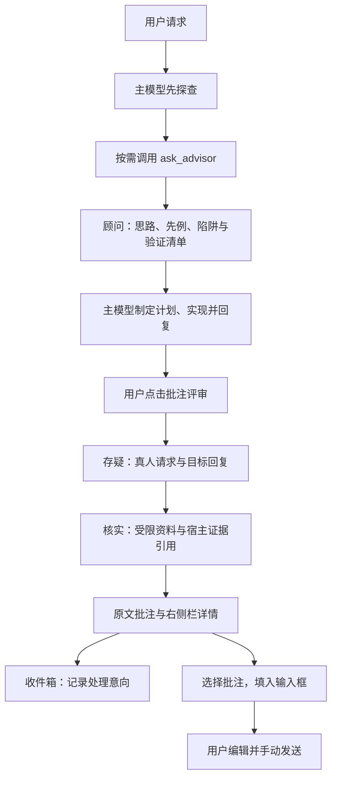

<p align="center">
  
</p>

<p align="center">
  <a href="https://www.npmjs.com/package/dsh-ciel"></a>
  <a href="https://www.npmjs.com/package/dsh-ciel"></a>
  <a href="https://github.com/higekibaka/dsh-ciel/actions/workflows/ci.yml"></a>
  <a href="./LICENSE"></a>
</p>

<p align="center"><a href="./README.en.md">English</a> | <b>中文</b></p>

# dsh-ciel（夏尔）

[DeepSeek Harness](https://github.com/deepseek-ai/deepseek-harness)（DSH）的规划前顾问与批注评审插件。主模型先探查，顾问通过 `ask_advisor` 提供思路；用户对助手回复发起两阶段受限评审，再决定如何处理批注。

当前版本：**[0.19.0](https://github.com/higekibaka/dsh-ciel/releases/tag/v0.19.0)** · [npm](https://www.npmjs.com/package/dsh-ciel/v/0.19.0) · [变更记录](CHANGELOG.md)。本轮兼容性与 CI 验证目标是 **DSH 0.1.6-alpha.2**。

## 安装与开始使用

```sh
dsh plugin --profile web add dsh-ciel@0.19.0
```

在自己的目标 profile 中安装或更新后，重启 DSH 并刷新浏览器。进入 **设置 → 夏尔 Ciel**，选择已在 DSH 中配置的顾问、批评者模型并保存；默认路由不会替你注册提供方或凭据。

1. 主模型先读、搜或执行必要的探查，再按需调用 `ask_advisor`。顾问只提供思路、先例、陷阱与验证清单，主模型负责计划和实现。
2. 在助手回复上点击 **批注评审**。默认先提出疑点，再在受限资料范围内核实；生成的批注显示在原文和原生右侧栏。
3. 打开左侧 **夏尔收件箱**，查看当前会话的评审，为批注标记「待判断／准备处理／暂不采纳」。这些标记只记录你的处理意向。
4. 在评审详情选择批注并点 **填入输入框**，编辑草稿后手动发送。已有文字、引用和附件会保留；收件箱标记不会触发修复或发送消息。

`/advise` 命令已移除，已有顾问和命令记录保留；顾问咨询使用 `ask_advisor`。

## 工作流程



规划提醒与咨询额度共用咨询状态；被准入门拒绝的请求不占额度。评审由用户触发，进度恢复和历史加载不会自动启动模型。

## 0.19.0 更新

- 新增当前会话收件箱，意向独立保存，支持分页、刷新和并发修改冲突提示。
- 适配 DSH 0.1.6-alpha.2 的 Remote、共享依赖和会话状态；错误区分协议不兼容、未就绪、能力缺失与运行失败。
- 修复分叉会话复用消息 ID 时串用批注，以及取消接受后仍提交正常结果的竞态。
- 评审按目标回复前的真人输入取材，处理压缩、goal 续跑、分叉和旧命令来源；上下文不足时明确说明覆盖受限。
- 进度同步有界退避并提供显式重试；客户端清理卸载后的迟到请求，合并重复刷新，限制未使用会话缓存。
- 拆分评审编排、仓储、协议、顾问状态及客户端状态模块，记录后续容量与恢复决策。

## 收件箱、草稿与历史

收件箱只列出当前选中的会话，每页最多 25 条评审；计数和筛选只针对当前页。列表与意向读写不调用模型，也不改写草稿。打开评审、证据与顾问历史使用 DSH 原生右侧栏。

意向与评审详情中的批注选择相互独立。另一标签页已修改同一条意向时会提示冲突，可刷新后重试；若持久化意向绑定的评审内容已变化，会明确报指纹不匹配，当前版本不自动重置或迁移。多个 Host 同时写入同一 `DSH_HOME` 不受支持。

历史批注按会话和消息共同关联。缺少原消息、证据不可用、加载失败与没有记录分别提示；定位历史消息可能需要先加载对应历史。打开「当前文件」是查看现有源码，不能替代评审时保存的证据。

## 评审范围与费用

默认评审分两阶段：存疑只看真人请求和目标回复；核实再使用受限源码副本与证据引用。工具化核实在 Ciel 私有的 worker + QuickJS/WASM 中执行，只能通过受控的 `read` / `grep` / `glob` 读取本次不可变资料；缺少守卫或运行能力时明确失败，不回退不受限工具。

每个会话最多一个在途评审。默认 180 秒总时限包含资料准备和两个阶段；可手动停止，超时不追加模型整理、不自动延长。进度同步连续失败最多探测四次后暂停，可显式重试同步；重试同步不等于重新评审。

**时限不等于费用上限。** 两阶段及工具后的继续生成会请求模型，提供方也可能重试。输出上限是单次响应限制，停止不会退回已消耗的 tokens。关闭 `enabled` 取消在途顾问和评审，并禁止新调用；关闭 `criticExploreEnabled` 只关闭工具核实，仍会调用模型。

零批注不等于事实已全部核实。未查项、截断输入、缺少附件内容及失败阶段会保留覆盖说明。宿主验证证据引用是否属于本次账本，但引用本身不证明结论为真。程序可见的回执也不等于模型读取了全部文件，模型只看到程序打印或返回的内容。

## 配置

设置位于独立的 **夏尔 Ciel** 页面，命名空间为 `ciel`。修改后点击保存；切换设置页保留草稿，刷新不自动保存。不同位置的修改有版本冲突保护。

| 字段 | 默认 | 说明 |
|---|---|---|
| `provider` | `kimi-coding` | 顾问提供方路由（须已在设置 → 模型 注册） |
| `model` | `kimi-for-coding` | 顾问模型 id；跨家族模型多样性收益更大 |
| `reasoningEffort` | `provider` | 注入每次咨询的思考深度；`provider` 跟随提供方默认 |
| `maxTokens` | `4096` | 顾问单次输出上限（256–32768） |
| `maxCallsPerTurn` | `3` | 每轮咨询额度：1 次发散 + 追问预算 |
| `requireExploration` | `true` | 首次咨询前要求先探查 |
| `enforceFollowupGap` | `true` | 追问之间要求独立工作 |
| `planReminderEnabled` | `true` | 规划时刻提醒 |
| `guidanceEnabled` | `true` | 注入使用协议到系统提示词 |
| `criticProvider` | `google` | 批评者提供方路由（独立于顾问管道） |
| `criticModel` | `gemini-3.8-flash` | 批评者模型 id |
| `criticEffort` | `medium` | 注入评审请求的思考深度；亦接受 `provider` |
| `enabled` | `true` | 本插件调用总开关；关闭取消在途顾问/评审，并禁止新调用与新回传 |
| `advisorTimeoutSeconds` | `180` | 单次 `ask_advisor` 顾问咨询总时限，10–600 秒 |
| `criticExploreEnabled` | `true` | 两阶段评审：先存疑，再只读核实 |
| `criticTimeoutSeconds` | `180` | 评审唯一的执行预算：准备资料、存疑、核实共用总时限，10–600 秒 |
| `criticMaxTokens` | `16384` | 单条模型响应的大小保护，256–32768；存疑最多 4096，不限制模型请求次数 |

高级设置 `criticAdditionalRoots` 默认为 `[]`，可添加明确允许核查的源码目录。旧 `criticExploreBudget` / `criticMaxRequests` 仍能加载，但不再限制请求次数。

## 兼容性与数据

- 本轮实际验证 DSH **0.1.6-alpha.2**。原生接口起点为 0.1.5-alpha.2，旧版本没有在本轮逐一复测；升级 DSH 后仍需确认插件兼容性。
- Node.js `^22.19.0` 或 `>=24.0.0`。受限文件捕获目前要求 Linux 与可访问的 procfs；浏览器界面不因此限定为 Linux。
- 需要 DSH 提供共享 Cordis、Typert、`dsh-subagent`、`dsh-llm` 和 `dsh-tools`，不能把 Ciel 当作独立 Host 运行。源码链接安装请读 [共享依赖说明](docs/compatibility-alpha2.md)。
- Ciel 使用 DSH 主题语义变量；默认与终末地玻璃的明暗模式、主题退出和插件卸载已做隔离 Web 回归。
- 记录保存在 `$DSH_HOME/ciel/v1/`，按会话、记录类型和标识关联，采用有界读取与原子写入。旧 `dsh-advisor` JSONL 历史不读取或迁移；`ciel` 设置保留。
- 客户端最多缓存 8 个未使用会话、约 16 MiB 结果正文；显示中或请求中的会话会保留。这是缓存策略，不是整个浏览器内存上限，也不删除磁盘历史。

完整约束见 [评审契约](docs/review-contract.md)、[读取隔离](docs/read-isolation.md) 和 [容量与恢复决策](docs/architecture-decisions.md)。

## 开发与验证

根目录是开发包，`plugin/` 是发布包；`plugin/src/` 构建为 `plugin/client.js`。

```sh
pnpm install --frozen-lockfile
pnpm --dir plugin install --frozen-lockfile
node scripts/build-client.mjs --check
node --test plugin/test/*.test.js

# 使用已构建的 DSH 检出；链接脚本只用于开发副本
DSH_CHECKOUT=/path/to/deepseek-harness node scripts/link-harness-peers.mjs
DSH_CHECKOUT=/path/to/deepseek-harness CIEL_VERIFY_NATIVE_PEERS=1 node scripts/verify-runtime.mjs
DSH_CHECKOUT=/path/to/deepseek-harness node scripts/verify-protocol.mjs
```

0.19.0：**605 个单元测试、52 个实际 DSH 受限运行链场景、21 个原生侧栏检查通过**，远端 [CI](https://github.com/higekibaka/dsh-ciel/actions/runs/35447737250) 与 [发布流水线](https://github.com/higekibaka/dsh-ciel/actions/runs/35448102257) 成功。npm 包有来源证明，全部 24 个发布文件与候选一致。

运行链使用脚本模型、网络 0；隔离真实 Web 验证了评审、收件箱、分叉、刷新、协议故障、主题与卸载。以上不证明真实提供方的质量、成本或长时负载。Web 联调必须让服务使用独立 `DSH_HOME`，只换端口或 profile 不会隔离会话；不要把日常环境用于夹具。

后续实现从 [当前架构](docs/architecture.md) 开始，用 [评审契约](docs/review-contract.md) 验收；历史版本记录见 [CHANGELOG](CHANGELOG.md)，设计动机见 [设计说明](docs/design.md)。

## 许可证

[MIT](LICENSE)
