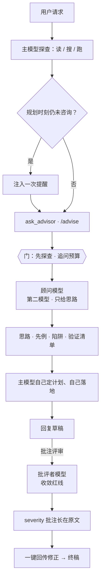

<p align="center">
  
</p>

<p align="center">
  <a href="https://www.npmjs.com/package/dsh-ciel"></a>
  <a href="https://www.npmjs.com/package/dsh-ciel"></a>
  <a href="https://github.com/higekibaka/dsh-ciel/actions/workflows/ci.yml"></a>
  <a href="./LICENSE"></a>
</p>

<p align="center"><a href="./README.en.md">English</a> | <b>中文</b></p>

# dsh-ciel（夏尔）

[DeepSeek Harness](https://github.com/deepseek-ai/deepseek-harness)（DSH）的**规划前顾问 + 收敛批评者**：在主模型制定计划之前，由一个知识分布不同的顾问模型提供思路、领域知识与陷阱清单——只给思路，不给步骤；另附每条助手回复的「批注评审」按钮，由批评者模型（默认 `google/gemini-3.8-flash`）对草案做红线批注。命名灵感：《关于我转生变成史莱姆这档事》中主角的脑内参谋大贤者夏尔。

顾问模式的价值不在于"顾问更聪明"，而在于**引入分布多样性 + 分离探索与执行两种认知角色**，并用"只给思路"的约束把理解和落地的工作强制留在主模型身上。完整论证见 [docs/design.md](docs/design.md)。

## 工作流程



两条管道刻意**角色分离**：

```text
  发散（规划前）                    收敛（成稿后）
  ─────────────                    ─────────────
  顾问管道                          批评者管道
  ask_advisor · /advise            批注评审
  思路 · 先例 · 陷阱 · 验证清单      红线批注 · severity 分级
  只给方向，不下场                  证伪输出，不复盘心路
  开阔主模型的解空间                收窄成稿的风险面
```

## 功能

- **`ask_advisor` 工具**——一次同步咨询：思路、先例、陷阱、验证清单；受「先探查后咨询」门与追问预算约束。
- **指导 prompt section**——咨询协议注入系统提示词（可开关）。
- **批注评审**——每条助手回复操作区的「批注评审」按钮：批评者对草案做收敛型红线评审，批注以 severity 波浪下划线 + 角标长在原文上，另有完整评审面板；评审记录持久化、跨重启水合。
- **`/advise` 命令**——人类触发咨询：上下文自动装配、结果卡片、自动知会主模型。
- **设置卡片**——设置 → 插件 → 插件配置 → 夏尔 Ciel，热生效无需重启。

<p align="center">
  
</p>
<p align="center">
  
</p>
<p align="center">
  <picture>
    <source media="(prefers-color-scheme: dark)" srcset="https://github.com/higekibaka/dsh-ciel/raw/main/docs/images/ciel-card-groups-dark.png">
    
  </picture>
  <picture>
    <source media="(prefers-color-scheme: dark)" srcset="https://github.com/higekibaka/dsh-ciel/raw/main/docs/images/ciel-card-critic-dark.png">
    
  </picture>
</p>

## 安装

```sh
dsh plugin --profile web add dsh-ciel
```

重启 DSH 后生效：工具与指导 section 对所有 preset 全局可用，设置卡片出现在 **设置 → 插件 → 插件配置**。

> 从 dsh-advisor（≤ 0.10.x）升级？`settings.yaml` 里的 `advisor:` 节会在首次启动时**自动迁入**新的 `ciel` 命名空间；旧节保留不删，可随时手工移除。

## 配置项（`ciel` 命名空间）

| 字段 | 默认 | 说明 |
|---|---|---|
| `provider` | `kimi-coding` | 顾问提供方路由（须已在设置 → 模型 注册） |
| `model` | `kimi-for-coding` | 顾问模型 id；跨家族模型多样性收益更大 |
| `reasoningEffort` | `provider` | 注入每次咨询的思考深度；`provider` 跟随提供方默认 |
| `maxTokens` | `4096` | 顾问单次输出上限（256–32768） |
| `maxCallsPerTurn` | `3` | 每轮咨询额度：1 次发散 + 追问预算 |
| `requireExploration` | `true` | 首次咨询前要求先探查 |
| `enforceFollowupGap` | `true` | 追问之间要求独立工作 |
| `planReminderEnabled` | `true` | 规划时刻提醒 |
| `guidanceEnabled` | `true` | 注入使用协议到系统提示词 |
| `criticProvider` | `google` | 批评者提供方路由（独立于顾问管道） |
| `criticModel` | `gemini-3.8-flash` | 批评者模型 id |
| `criticEffort` | `medium` | 注入评审请求的思考深度；亦接受 `provider` |
| `enabled` | `true` | 本插件调用总开关；关闭取消在途顾问/评审，并禁止新调用与新回传 |
| `advisorTimeoutSeconds` | `180` | 单次顾问或 `/advise` 总时限，10–600 秒 |
| `criticExploreEnabled` | `true` | 两阶段评审：先存疑，再只读核实 |
| `criticExploreBudget` | `5` | 允许执行的只读工具次数，0–10；0 关闭探索，但仍调用模型 |
| `criticTimeoutSeconds` | `180` | 一次评审全部阶段总时限，10–600 秒 |
| `criticMaxRequests` | `16` | 一次评审的模型步骤请求上限，2–32；提供方内部重试另由 DSH 管理 |
| `criticMaxTokens` | `16384` | 每次批评者请求的输出上限，256–32768；存疑最多 4096、抢救最多 8192 |

## 评审结果与费用

存疑阶段只看用户请求和草稿，核实阶段才收到作者工具证据及顾问清单。合法空清单显示“未核实”，格式失败显示错误；未查完、逐项结果缺失/冲突及抢救产出显示“不完整”，不作为完整通过。宿主分配疑点编号，按逐项结果自己计数、生成总评；已排除或未查项的提醒批注会被剔除，规则见 [评审契约](docs/review-contract.md)。证据字段是模型引用，不代表程序已经验证引用内容为真；回传后作者仍应核对，而不是盲目修改。

每个会话同时允许一项评审；评审中可点“停止”。只在工具预算熔断且有带引用的部分调查记录时，才允许一次无工具抢救；取消、超时、网络错误及请求额度耗尽不会触发抢救。

**工具次数不是金额上限。** 两阶段及工具后的继续生成都会请求模型，输入上下文也会计费；输出上限是每请求上限，不是整轮总额，DSH 提供方还可能重试。停止不会退还已经消耗的 tokens。要禁止 Ciel 调用请关闭 `enabled`，而不是仅把探索预算设为 0；此前已回传给主模型的修复轮次不归此开关取消。

## 兼容性

- 当前安全调用需要 DSH 的 `tools.guard()`、`settings.plugin.item` 和 Typert Remote；已在 **0.1.3-alpha.1** 的真实执行链验证。缺少执行前守卫的旧版本会明确拒绝模型调用，不降级为不受控调用。旧评审记录仍可读取。
- Node.js ≥ 22。
- 可与 [omdsh-dev/dsh-advisor](https://github.com/omdsh-dev/dsh-advisor) 共存：0.11.0 起设置命名空间迁至 `ciel`，两插件可同装。

## 开发验证（隔离会话与配置）

**只换 profile 或端口并不隔离历史。** 共享 `DSH_HOME` 的测试实例仍会把普通评测会话写入主 GUI 的会话库，出现在“未分组”。浏览器 A/B 必须让测试服务本身使用独立的 `DSH_HOME`；只给驱动脚本设置该变量无效，也不要连接主 GUI 做评测。

优先使用下面的 `verify-runtime.mjs`：它自动使用临时 `DSH_HOME` 并在结束时清理，不留下主侧边栏测试会话。Ciel 的后台子会话由 DSH 按 `origin: subagent` 隐藏，不能把用户正常的主会话一起隐藏。

离线回归：在 `plugin/` 下 `node --test`，无需密钥。真实 DSH 工具链离线回放（不启动 Web）：

```sh
DSH_CHECKOUT=/path/to/deepseek-harness node scripts/verify-runtime.mjs
```

显式允许 DeepSeek 实测时，在同一命令后加 `--live`，并通过环境提供 `CIEL_ALLOW_PAID_TESTS=1`、`DEEPSEEK_API_KEY`；脚本固定使用 `deepseek-v4-flash-vision-exp`，禁止其他网络目标。不要把密钥写进参数或仓库。

旧的浏览器 A/B 驱动需要显式提供 `CIEL_ALLOW_PAID_TESTS=1`、`CIEL_AB_MODEL`、`CIEL_AB_CRITIC_PROVIDER`（可另设 `CIEL_AB_CRITIC_MODEL`），模型和消息身份不明确即停止。它重新生成作者草稿，因此是诊断工具，不是严格的模型质量排名；优先使用固定夹具回归。

## 许可证

[MIT](./LICENSE) © hgk
