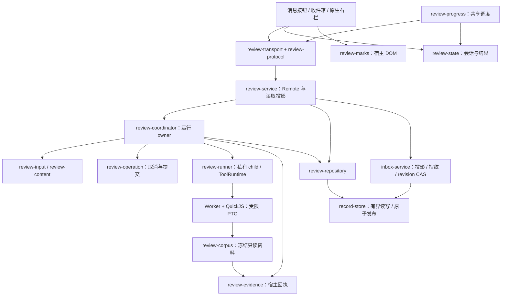

# Ciel 架构与后续决策

2026-09-19；当前核对环境为 DSH **0.1.6-alpha.2**、Ciel **0.19.0**。

业务验收以 [review-contract.md](review-contract.md) 为准：主模型先探查，`ask_advisor` 提供思路；用户触发两阶段受限评审；收件箱记录处理意向；批注填入草稿后由用户手动发送。`/advise` 已移除，旧记录及可核对的旧请求来源保留兼容读取。本文件规定模块责任、生命周期和演进边界，不另起一套产品流程。

## 已完成的架构调整

原先七项建议已经逐项复核。输入规则、评审编排与仓储、Client 状态与调度、共用协议、DOM 锚点边界已落实；顾问状态继续共用事实分类，并补齐保存时的取消检查。没有为已经删除的命令入口新建顾问执行框架。容量方面落实页面缓存释放；服务级额度、跨进程事务和历史删除属于独立产品/部署决策，见 [architecture-decisions.md](architecture-decisions.md)。

| 模块 | 责任 | 不承担的工作 |
|---|---|---|
| `plugin/index.js` | Cordis 组装、设置、顾问工具注册、模型路由与 effort 监听 | 不编排评审阶段、不直接读写评审文件 |
| `advisor-state.js` | 咨询事实、额度预占和规划提醒；拒绝/在途/已结束共用同一分类 | 不把用户引用的提醒文本当作宿主快照；不新增自动咨询 |
| `review-input.js` | 目标消息前的真人要求投影，压缩/goal/分叉/历史命令归属与受限原因 | 不猜测跨轮语义任务，不读取父会话后续记录 |
| `review-content.js` | 阶段提示词、证据输入整理、Markdown 块与评审结果解析、只读子代理观察 | 不调用模型或保存记录 |
| `model-usage.js` | 请求路由和实际执行来源的有界投影 | 不把配置值冒充实际用模 |
| `review-coordinator.js` | 唯一的评审运行 owner：准入、两个阶段、私有 child、进度、取消、终态与清理 | 不实现文件系统协议，不持有 UI 状态 |
| `review-repository.js` | 评审/证据/顾问/回传记录访问；证据先写、summary 提交；可注入 store/home | 不判定模型结论，不修改全局 fs 以提供测试缝隙 |
| `review-service.js` | Typert Remote 入口、读取投影、批注草稿准备、收件箱转发；start/progress/cancel 委托 Coordinator | 不运行 critic 阶段；旧 feedback 只返回停用说明 |
| `review-protocol.js` | 13 个方法的统一 descriptor、请求/返回形状与关联身份检查 | 不依赖 DSH、Node、DOM 或第二份 schema 库实例 |
| `src/review-transport.js` | Remote 就绪/注册/释放、信封解包、调用前后校验与错误分类 | 不自动重跑模型 |
| `src/review-state.js` | hydrate、结果代际、分诊状态、会话 pin 与缓存释放 | 不持有 DOM，不删除磁盘记录 |
| `src/review-progress.js` | 一个共享计时器、可见性、每消息 single-flight、退避/暂停/显式重试 | 不扫描消息正文，不创建每消息定时器 |
| `src/review-marks.js` | 宿主 Markdown 锚点、所有权清理、单个共享 observer | 不持有 Remote/评审状态；点击由上层 callback 处理 |
| `src/client.js`、`sidebar.js`、`inbox.js` | 原生 UI 组装、卡片/portal/草稿与资源交互 | 不维护平行的主题、会话或自动发送系统 |

这些是职责边界，不以文件行数作为验收。`review-content` 仍包含多种纯解析函数；只有新增规则需要独立复用或出现测试耦合时，再沿输入/结果边界细分。



## 运行与提交所有权

一次评审只有 Coordinator 的终态处理器能发布正常结果或错误/取消结果。各阶段可以终止或抛出已分类错误，但不自行保存失败记录；外层统一捕获、记录诊断并执行清理。私有子代理、abort 监听、进度和 active registry 均归本次操作；清理副本异常也不能阻断 registry 释放。

取消的线性化点继续由 `review-operation` 与 `record-store` 共同提供：

```text
running → cancelled
running → committing → finished
```

正常 summary 的临时文件完成写入/fsync 后，rename 前同步执行 `beginCommit()`；此前取消可接受，此后返回 `cancelled:false, phase:'committing'`。Repository 先写证据，summary 是可访问性的提交标记。未提交证据不能绕过 `readReview` 独立读取。顾问记录也在发布前检查同一操作状态，避免取消/停用发生在异步保存期间后仍落下正常记录。

磁盘失败可能同时阻止正常记录和错误记录写入；不能承诺每个错误都有磁盘记录。rename 原子性也不等同于完整断电持久性。目录、链接、权限与文件大小保护继续由现有 `record-store` 负责，没有降级或越权回退。

## 协议与兼容性

Host 与 Client 从同一 `review-protocol.js` 构造 descriptor。`create()` 适配当前 Typert，`schema` 为旧形态保留相同校验器；这只说明适配器没有放宽验证，**不代表所有旧 DSH 版本已经实测兼容**。

请求只接受已声明字段及有界身份、页大小、批注序号、枚举与 revision；旧 `feedback` 接受旧对象后明确拒绝自动发送。响应检查业务形状，保留可扩展元数据，同时核对请求与返回的 session/message/review/evidence 归属。无效返回不会清空状态、标记加载完成或推断评审已经结束。

当前 DSH Gateway 实际执行请求 codec；其 Client unary 调用路径直接返回 `result.value`，**不会执行返回值 codec**。因此 Ciel Transport 显式执行返回验证。仅改 descriptor 或只测 schema 工厂都不能证明这条边界生效。

错误分为协议不匹配、Remote 未就绪/接口/挂载/卸载、受限后端依赖/守卫/运行时/执行、数据损坏/冲突等。协议错误为永久错误，暂停进度同步并提示刷新/核对 Host 与 Client；可恢复连接错误仍最多四次探测、按 1/2/4 tick 退避。显式重试同步不等于重新启动模型。

## Client 生命周期与容量

消息键始终是 `(sessionId,messageId)`。目标会话、结果时间/持久性代际和分诊 touched 标志决定是否接纳数据；旧请求不能覆盖新结果，fork 继承相同 messageId 也不会串用缓存。

- 一次非强制 hydrate 共享现有加载；加载期间的多次 force 合并成**一个后续的新加载**。不使用旧查询冒充最终同步，也不为每次重连积累一条完整查询链。
- 单次历史遍历最多 100 页/约 32 MiB 序列化估算；超过上限明确报告未完整加载，并指向收件箱分页查看，不建议未定义的自动删除。
- 最多缓存 **8 个未使用会话、16 MiB 结果正文估算**，超过任一条件按最近访问释放。对应结果、分诊、勾选、折叠、错误与 hydrated 状态一起清理，再打开时重新读盘；不影响已填入宿主输入框的草稿。
- 已挂载按钮与在途 hydrate/start/分诊/草稿操作 pin 会话，直至结果处理结束；它们可以超过上述软上限。该数字不是整个浏览器堆/RSS 上限。右栏路径映射另保留最近 16 个会话。
- dispose 后的成功、失败和强制 follow-up 都不能重新填充状态、启动轮询或覆盖输入框。共享 scheduler 释放 timer、可见性监听和 pin；共享 mark supervisor 释放 observer，React effect 清理由自身创建的 DOM。

缓存释放可能丢弃已离开会话的页面临时勾选/折叠；已成功保存的分诊和意向可恢复，尚未保存的本地选择不是持久化承诺。

## 验证依据

仓储测试通过注入 store，在证据写入、summary 提交前/后以及写入失败处确定性命中边界，不再需要全局 fs monkeypatch 才能增加新场景。原有真实磁盘竞态测试仍保留。

`node scripts/verify-protocol.mjs`（设置 `DSH_CHECKOUT`）使用当前 DSH Registry/Gateway、Ciel 实际 Remote/Transport、临时记录与内存 carrier；验证注册、坏请求拒绝、CAS、草稿准备、旧客户端拒绝和返回校验。它不等同于浏览器或 HTTP 验收。`scripts/verify-runtime.mjs` 使用当前真实 DSH 代理/工具/受限运行时及本地脚本模型，验证业务链；不证明外部模型质量或成本。

本轮证据位于工作区 `reviews/ciel-architecture-completion-20260919/`。200 会话 × 每会话 10 条 × 每条 8192 字符的五次合成 Client 测量中，保留结果由 2000 条/200 会话降为 80 条/8 会话，正文估算由 33,271,600 降为 1,331,040 字节，请求数仍为 200。中位耗时约 21.8 → 40.2 ms：新增校验与记账有成本，不能称为全面提速。这是生产 bundle + 模拟 Remote/DOM 的测量，不是 DSH/主题的 CPU 或实际浏览器 RSS。

## 后续应怎样迭代

以 [review-contract.md](review-contract.md) 写行为验收，以本文件选择模块边界。只有触发 [architecture-decisions.md](architecture-decisions.md) 中的需求后，才实施服务级容量、跨进程事务、显式恢复或删除；先写相应产品规则，再实现和验证。无需重新更换 UI 框架、引入全局消息总线或仅为了文件更短引入数据库。
