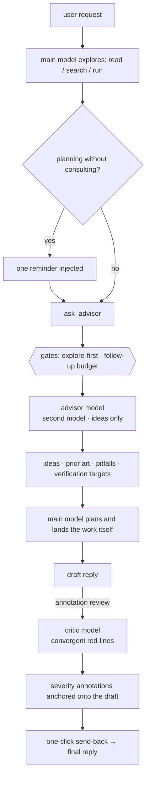

<p align="center">
  
</p>

<p align="center">
  <a href="https://www.npmjs.com/package/dsh-ciel"></a>
  <a href="https://www.npmjs.com/package/dsh-ciel"></a>
  <a href="https://github.com/higekibaka/dsh-ciel/actions/workflows/ci.yml"></a>
  <a href="./LICENSE"></a>
</p>

<p align="center"><b>English</b> | <a href="./README.md">中文</a></p>

# dsh-ciel（夏尔 Ciel）

A pre-planning advisor and a convergent critic for
[DeepSeek Harness](https://github.com/deepseek-ai/deepseek-harness) (DSH) —
a second, knowledge-rich model that offers directions, prior art, pitfalls,
and verification checklists **before** the main model commits to a plan.
Ideas, never steps. Named after Ciel, the in-head advisor from *That Time I
Got Reincarnated as a Slime*.

The value is not "the advisor is smarter" — it is **distribution diversity**
plus a forced separation of the exploring and executing cognitive roles. By
constraining the advisor to ideas only, understanding and landing the work
stays with the main model. Full argument: [docs/design.md](https://github.com/higekibaka/dsh-ciel/blob/main/docs/design.md).

The `/advise` command has been removed. Advisor consultations use `ask_advisor`; existing command and advice records are retained.

## How it flows

The local DSH 0.1.6-alpha.1 integration uses `ptcRuntime` and resolves PTC requests before execution. Ciel's private review runtime retains the shared review deadline and rejects per-call timeout or filesystem-policy overrides. DSH 0.1.5 installations continue to use `codeRuntime`.



The two pipelines are deliberately **role-separated**:

```text
  divergent (pre-plan)                  convergent (post-draft)
  ────────────────────                  ───────────────────────
  advisor pipeline                      critic pipeline
  ask_advisor                 annotation review
  ideas · prior art · pitfalls          red-lines · severity tiers
  widens the solution space             narrows the risk surface
  directions, never steps               falsifies output, never
                                        the author's reasoning
```

## What you get

- **`ask_advisor` tool** — one synchronous consultation with the advisor
  model, gated by an explore-first protocol and a bounded follow-up budget.
- **Guidance prompt section** — the consultation protocol injected into the
  system prompt (toggleable).
- **Annotation review (批注评审)** — a per-reply button that runs the
  convergent critic (default `google/gemini-3.8-flash`) over the draft and
  anchors red-line annotations onto the reply text, with severity
  underlines, badges, and a full review panel. Reviews persist across
  restarts.
- **Native right-sidebar resources** — reviews, historical evidence and
  advisor records register as three `dsh-resource://` resources and tab
  bodies. The chat keeps the summary and badges; the sidebar shows the full
  annotations, citations and advice items. A provider reads once and ends
  its stream: no background watch, no polling, no model call, and a failed
  resource never shows the last successful value.
- **Dedicated settings page** — Settings → 夏尔 Ciel, after Agent presets in
  the left navigation. Native switches and read-only tags; changes apply only
  after Save, and unsaved drafts survive navigation. No duplicate plugin editor.

> The screenshots below show the older settings and advisor cards. The current
> UI uses a dedicated left-navigation settings page and native right-sidebar
> resources; the latter has no published screenshot yet, and none is faked here.

<p align="center">
  
</p>
<p align="center">
  <picture>
    <source media="(prefers-color-scheme: dark)" srcset="https://github.com/higekibaka/dsh-ciel/raw/main/docs/images/ciel-card-groups-dark.png">
    
  </picture>
  <picture>
    <source media="(prefers-color-scheme: dark)" srcset="https://github.com/higekibaka/dsh-ciel/raw/main/docs/images/ciel-card-critic-dark.png">
    
  </picture>
</p>

## Ciel Inbox (0.19.0)

The first inbox version gathers the current session's reviews into one list so you can mark your own intent per annotation. It is an **inbox, not a repair action**: an intent never drives a model, never edits the input draft, and never changes the review itself. The inbox passed isolated Web validation; acceptance in the daily profile remains pending.

- **Entry and scope**: a left-sidebar panel-list entry (same id as the main panel, labelled "夏尔收件箱" (Ciel Inbox), count in the centre). It lists the currently selected session only; opening it, switching sessions or refreshing fetches a single page — no new resident polling or DOM observers, and the page caches only the current page plus a bounded cursor.
- **Paging and counts**: at most 25 reviews per page (also the default), in the stable persisted hashed-filename order; counts and filters cover the current page only, never a cross-page total.
- **Intent**: each annotation is `pending` (undecided) / `planned` (will handle) / `rejected` (not adopting for now), defaulting to `pending`. Intents live in their own new record (`kind: inbox`, one small record per review) and **never reuse the legacy accept/dismiss checkboxes and never read or migrate old `feedback` state**.
- **Write safety**: `inboxSetIntent` must carry the server-issued content fingerprint `reviewFingerprint` and the review's `revision`; a mismatch fails explicitly (`fingerprint_mismatch` / `revision_conflict`) with no implicit reset, and stored state that no longer matches the current review is never masked as `pending`.
- **Zero model calls**: listing and intent writes never call a model and never touch the draft; returned string summaries and annotation fields are bounded, and raw bodies, evidence text and source are never returned. Reading a review or its evidence still goes through the native right sidebar.
- **Limits**: concurrent writes for one review are serialized **in-process only** (a module-level queue shared across service instances; across processes only the atomic rename window remains). Historical anchor location and loading are user-triggered and bounded, and automatic location is not guaranteed in this version; after a `reviewFingerprint` mismatch, recovery needs an explicit scheme — no implicit reset in this first version. Returning to a session opens reviews and evidence in the native right sidebar; this version does not offer a layout that keeps the centre panel and the right rail resident at the same time.

## Install

```sh
dsh plugin --profile web add dsh-ciel
```

Restart DSH. The plugin activates globally: the `ask_advisor` tool and the
guidance section reach every agent in every preset; the dedicated page
appears under **Settings → 夏尔 Ciel**.

> Upgrading from `dsh-advisor` (≤ 0.10.x)? Your `advisor:` section in
> `settings.yaml` is copied into the new `ciel` namespace automatically on
> first boot. The legacy section is left in place — remove it by hand
> whenever you like.

## Configuration

All fields live in the `ciel` settings namespace (the settings card or the
`ciel:` section of `settings.yaml`):

| Field | Default | Description |
|---|---|---|
| `provider` | `kimi-coding` | Advisor provider route (must be registered under Settings → Models) |
| `model` | `kimi-for-coding` | Advisor model id; cross-family diversity pays most |
| `reasoningEffort` | `provider` | Thinking depth pinned onto each advisor request; `provider` follows the provider default |
| `maxTokens` | `4096` | Advisor reply length cap (256–32768) |
| `maxCallsPerTurn` | `3` | Consultations per turn: 1 divergence + follow-up budget |
| `requireExploration` | `true` | First consultation requires a prior non-advisor tool call |
| `enforceFollowupGap` | `true` | Follow-ups require independent work in between |
| `planReminderEnabled` | `true` | One reminder when planning starts unconsulted |
| `guidanceEnabled` | `true` | Inject the consultation protocol into the system prompt |
| `criticProvider` | `google` | Critic provider route (independent of the advisor pipeline) |
| `criticModel` | `gemini-3.8-flash` | Critic model id |
| `criticEffort` | `medium` | Thinking depth pinned onto critic requests; `provider` also accepted |
| `enabled` | `true` | Allow Ciel model calls and feedback; turning off cancels its in-flight consultations/reviews |
| `advisorTimeoutSeconds` | `180` | Total deadline per `ask_advisor` consultation, 10–600 seconds |
| `criticExploreEnabled` | `true` | Separate nomination and read-only verification phases |
| `criticTimeoutSeconds` | `180` | Sole review execution budget: one deadline for capture, nomination and verification, 10–600 seconds |
| `criticMaxTokens` | `16384` | Per-response size protection, 256–32768; nomination capped at 4096, not a request-count limit |

## Review results and spending

Review feedback now stages text in the same session's input box; it never sends automatically. Existing text, reference chips and attachments stay intact. You edit and press Send yourself; staged annotations are not marked sent. If the input changes during preparation or the session switches, insertion is refused rather than overwriting anything. This requires DSH's scoped input-insert-text event; missing support fails closed, never falls back to automatic delivery.

Since 0.17.0, reviews have only a total-time execution budget (180 seconds by default). Queries and model requests are counted but never stop a review or withhold nominated suspects based on their count. Capture and both phases share one deadline without resetting it. Legacy `criticExploreBudget` / `criticMaxRequests` settings remain loadable but are ignored, including zero; only `criticExploreEnabled` controls file checking. No record in a turn-local digest is not proof that tests never ran; absent evidence and unrelated/older test reports must not be used to accuse fabrication.

Nomination sees only the request and draft; author evidence and advisor targets arrive during verification. A valid empty list means “not independently verified”, not a factual certification. Malformed responses fail explicitly. Unchecked suspects, missing/conflicting outcomes and legacy salvaged records remain visibly incomplete. Host-assigned suspect ids bind accepted annotations to selected defect outcomes; the host computes counts and the card summary, rejecting annotations on cleared or unchecked ids. Citations are model-authored evidence references, not programmatically verified truth; the author should check them before acting on feedback.

Review input is selected from human requests preceding the chosen draft. Correlated native compaction and goal continuations can preserve earlier requirements; forks never read later parent-session tasks. Generated summaries and goal prompts do not become human requirements. Missing links, truncation and image/attachment content omitted from the text review remain explicitly incomplete. See the [input rules](https://github.com/higekibaka/dsh-ciel/blob/main/docs/review-contract.md).

One review may run per session. Its Stop control cancels every phase. Deadline expiry stops the active work and records an incomplete/error outcome without an extra writer, automatic extension or retry. Normal completion, permission refusal and execution errors can still end work before the deadline. Since 0.18.0 the verification phase presents only the native reserved `run_code`: the critic program runs in Ciel's private worker + QuickJS/WASM and reaches the immutable in-memory snapshot only through `JSON.parse(await tools.read/grep/glob(...))`. `grep` is a literal search, the program body is TypeScript erasable syntax only, and missing capabilities fail closed instead of falling back to ordinary file tools. See [restricted PTC review](https://github.com/higekibaka/dsh-ciel/blob/main/docs/ptc-review.md).

**A time limit is not a money budget.** Both phases, follow-up generations after tools and repeated input context incur model usage. Output limits are per request, not an aggregate token cap; DSH provider retries may add attempts. Cancellation cannot refund consumed tokens. Use `enabled: false` to stop Ciel calls, or `criticExploreEnabled: false` to disable file checking only (model calls still occur); previously delivered feedback turns running in the author are not cancelled by this switch.

The dedicated page separates the global switch, common settings and advanced controls. Save submits one atomic revision-fenced mutation; navigation retains drafts, page reload never saves them, and newer external settings cannot be silently overwritten. Current-status tags show persisted values; staged previews are explicitly marked pending. Advisor and review cards retain per-call model provenance; missing historical identities are never inferred from current settings.

File verification uses a bounded immutable source snapshot of the current session's working directory. Advanced `criticAdditionalRoots` (default `[]`) explicitly adds other source directories. Ordinary tool output remains available; suspected credentials/private process evidence is withheld and coverage becomes incomplete. Detection is heuristic, not proof that every secret is absent. See [read isolation and model provenance](https://github.com/higekibaka/dsh-ciel/blob/main/docs/read-isolation.md).

**Restricted PTC is not a general sandbox.** The critic program has no ambient Node globals and cannot directly read live files, spawn processes, use the network or read session history; the root `codeRuntime` is unchanged, and missing capabilities fail the tooled phase instead of falling back. The private registry keeps DSH's nested scheduling and log format, with Ciel's own guard owning scope and deadline; isolated private `tools/result` events do not reach root observers, so not every global policy plugin applies to the review child. The program receives host-clipped receipts, but the model context only sees the summary and snippets the program prints or returns — do not read "the program saw it" as "the model saw every file". Native DSH child-session logs may still retain every nested query, so the Ciel snippet/record bounds are not a global trace-free promise.

## Records and evidence storage

> These bounds apply to Ciel-owned extra records. DSH may still retain native advisor/reviewer session logs, including unselected reads. Clearing Ciel records does not remove those sessions and does not promise global trace-free execution.

New records are written only under the versioned root
`$DSH_HOME/ciel/v1/<kind>/<sessionId>/<hash(id)>.json`, where `kind` is
`reviews` / `evidence` / `advice` / `inbox` (`calls` / `feedback` reserved). Each
record envelope carries `schemaVersion`, `kind`, `sessionId`, `id` and
`value`; a random `wx` temp file is atomically renamed over the same-key
target. Directories are 0700 and files 0600, a single record is capped at
512 KiB. Review lists use cursor pages of at most 200 records / 16 MiB (default 100), with explicit continuation; malformed data still fails explicitly. Triage is one serialized record per review, not one file per click. Reads verify session/record ownership, refuse
symlinks, hard links and non-regular files, and check size/identity before
and after the read. **Legacy `$DSH_HOME/dsh-advisor/` JSONL history is
neither migrated nor read; the `ciel` settings namespace is preserved.**

The host assigns `e1`, `e2`, … ids to real `read` / `grep` / `glob`
results; `groundReview` accepts only ids actually present in that run's
ledger, and a forged, foreign or unreturned id invalidates the citation (the
suspect falls back to unchecked). Stored snippets are bounded: 16 KiB / 200
lines per record by default and 128 KiB / 128 records per review in total.
The model sees exactly the bytes that were stored, and the full in-memory
copy is released when the review ends. `contentSha256` is a consistency
check — **it does not prove tamper-resistance and does not make a citation
true**.

`a1` is the "author-provided tool output" provenance marker: it records only
that the source existed, stores no raw text, and therefore makes coverage
incomplete. Sensitive-content checks run before the model input and again
before storage; both are **heuristic** and cannot prove that every secret is
absent. Obvious placeholders (`…`, `...`, `<token>`, `YOUR_API_KEY`,
`changeme`, `[redacted]`, `${ACCESS_TOKEN}`, including forms wrapped in
backticks, brackets, or list punctuation) are told apart from real
credential shapes so documentation examples do not block a review; real shapes
(credential values of 8+ characters, known key prefixes, private-key blocks,
URLs carrying a user and password, Bearer/Basic) are still refused. `readEvidence` reads historical snippets only through the
`evidenceIds` committed in a review; a missing or unavailable record fails
explicitly and **never falls back to the current file**. The current file can
only be opened through the Host-resolved `currentPath`.

Current-file navigation always retains the evidence-owning Session, including external absolute paths. Switch Markdown previews to code or plain text for source-line navigation; historical line numbers may no longer match current content. When two panes do not fit, comparison opens a single-column file tab; expand the native sidebar to fullscreen before comparing side by side.

## Compatibility

- The native UI requires **DSH 0.1.5-alpha.2 or newer**: `settings.section`,
  the shared platform Switch/Tag/Button, native resources and right-sidebar
  services, without copied components or styles and without extra file
  permissions. Safe model calls still require `tools.guard()` and Typert
  Remote; missing guards refuse calls instead of silently running unmetered.
  Legacy `dsh-advisor` reviews are no longer read; `ciel` settings are kept.
- Node.js `^22.19.0` or `>=24.0.0`. File capture currently requires Linux
  and accessible procfs descriptor APIs. Reviews also require the shared
  `dsh-subagent`/`dsh-llm`/`dsh-tools` APIs corresponding to 0.1.5-alpha.2
  (`dsh-tools` powers restricted PTC) and pin `quickjs-emscripten 0.32.0`;
  unavailable dependencies refuse reviews rather than falling back to ordinary
  file tools.
- Designed to coexist with [omdsh-dev/dsh-advisor](https://github.com/omdsh-dev/dsh-advisor):
  the settings namespace moved to `ciel` in 0.11.0 so both plugins can be
  installed side by side.

## Development

**A separate profile or port does not isolate session history.** Test servers sharing `DSH_HOME` still populate the main GUI's session store and Ungrouped list. Browser A/B requires the test server itself to use a separate `DSH_HOME`; setting it only on the driver is not isolation. Do not run browser evaluations against the main GUI.

Prefer `verify-runtime.mjs` below: it creates and cleans up a temporary `DSH_HOME`, without leaving sidebar test sessions. DSH already hides Ciel's subagent-origin child sessions; ordinary user conversations must not be hidden alongside them.

The repository root is a private development package
(`dsh-ciel-development`) that provides esbuild and the official
`@deepseek-ai/dsh-util-workspace-path`; the root `pnpm-workspace.yaml`
contains only the root package, so plugin dependencies install separately.
Browser sources live under `plugin/src/` (UI, state, progress, anchors and transport)
(plus `sidebar.css`), bundled into the single `plugin/client.js` by
`scripts/build-client.mjs`:

```sh
pnpm install
pnpm --dir plugin install --frozen-lockfile=false
node scripts/build-client.mjs --check   # verify client.js is current; rebuild with pnpm build:client
```

Run keyless regression tests with `node --test plugin/test/*.test.js` from
the root, or `node --test` inside `plugin/` (no network). Replay the real DSH
agent/tool chain without starting Web:

```sh
DSH_CHECKOUT=/path/to/deepseek-harness node scripts/verify-runtime.mjs
```

Verify the native right sidebar against the target DSH checkout (run from
inside that checkout, which supplies React/JSDOM and the real resource and
sidebar registries):

```sh
DSH_CHECKOUT=/path/to/deepseek-harness \
TSX_TSCONFIG_PATH=$DSH_CHECKOUT/tsconfig.base.client.json \
node --import tsx/esm /path/to/dsh-ciel/scripts/verify-sidebar-native.mjs
```

0.19.0 validation (2026-09-19): **605/605** unit tests and **52/52** actual DSH **0.1.6-alpha.2** restricted-runtime scenarios (scripted models, zero network). An isolated real Web profile also passed review/inbox, fork, refresh, protocol-failure, theme and unload checks on Node **24.21.0**. See the repository architecture and architecture-decisions documents for module ownership, inactive-session cache limits and unsupported multi-process writes. The daily profile has not been restarted for acceptance.

Historical 0.18.0 restricted PTC review: the default PTC execution chain passed **37/37** (0 failed, 0 network; the chain tests used scripted models and ran no additional real-model review or A/B tests), unit tests **428/428** (including the runtime 15 subset), Chromium fixtures **22/22** (0 page/console errors, 0 network), the native SettingsRoot regression (0 network/model) and `client --check` against source. The host change needs a **DSH restart plus a page refresh** (manual restart preferred); the formal instance still awaits manual GUI acceptance for 0.18.0. Test network 0 describes the tests only and does not mean the whole development task had no real-model calls. Candidate package smoke **18/18** (12 files unpacked, production-only install, real QuickJS Promise batch/`.then`/`for-await` from `/tmp`, module-relative worker resolution); with a cold cache `--prefer-offline` may pull dependency packages, so pack/install is not guaranteed network-free; tested only on Node 24.20.0, the Node 22.19 minimum is untested. See [restricted PTC review](https://github.com/higekibaka/dsh-ciel/blob/main/docs/ptc-review.md).

Historical 0.17.0 validation (time-only, still native readers): **390 unit tests**, **22 real DSH offline execution-chain scenarios**, **22 Chromium fixture checks**, and the native settings regression passed. The shared deadline includes source capture and both stages, without an extra model after timeout. That record does not mean 0.18.0 is deployed.

Historical 0.16.1 validation: **381 unit tests**, **23 real execution-chain scenarios** (including placeholder pass-through and real-token refusal), **21 native-sidebar checks**, **19 real-Chromium fixture checks**, and the native settings regression all passed. After the human upgrade to alpha.2, a second instance with an **isolated DSH_HOME** additionally passed real-browser checks: token→cookie authentication and refresh, Ciel activation, read-only paged RPC, native settings controls, right-sidebar mounting for a blank session, and `/advise` registration, with zero page errors and zero model prompts. That instance used synthetic records and isolated state, so it is **not** formal-instance acceptance. Real-session annotation/evidence/current-file interaction on the formal instance still needs manual checking.
CI installs root dependencies, runs `build-client.mjs --check`, and adds
an independent integration job pinned to an upstream commit.

For explicitly authorized live tests, add `--live` to `verify-runtime.mjs`
and supply `CIEL_ALLOW_PAID_TESTS=1` and `DEEPSEEK_API_KEY` through the
environment. The driver pins `deepseek-v4-flash-vision-exp` and rejects other
network destinations. Never place keys in arguments or source. `--live` is not run by default.

The browser A/B driver requires explicit `CIEL_ALLOW_PAID_TESTS=1`, `CIEL_AB_MODEL`, and `CIEL_AB_CRITIC_PROVIDER` (optionally `CIEL_AB_CRITIC_MODEL`), and refuses ambiguous model/message identity. It regenerates author drafts, so its results are diagnostic observations, not a controlled model ranking; prefer fixed-fixture regressions.

> After a local `pnpm install` inside `plugin/`, run
> `scripts/relink-dev.sh` once: the two `@deepseek-ai/*` devDependencies
> (cordis, typert-protocol) and available review peers (dsh-subagent, dsh-llm) use the profile's shared
> copies — a real second copy carries its own registry state and breaks the
> linked plugin. npm-installed deployments are unaffected (devDependencies
> are never installed for consumers).

## License

[MIT](./LICENSE) © hgk
