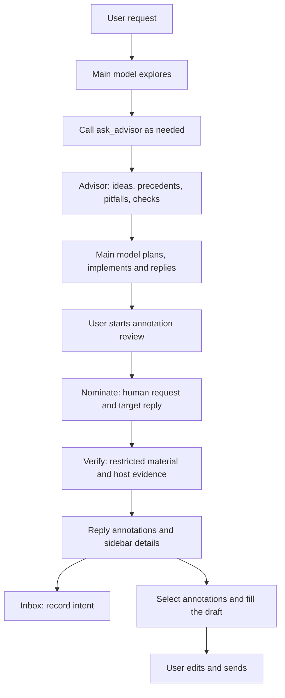

# dsh-ciel (Ciel)

A planning advisor and annotation reviewer for [DeepSeek Harness](https://github.com/deepseek-ai/deepseek-harness) (DSH). The main model explores first and calls `ask_advisor` for ideas. A user can then request a two-stage restricted review of an assistant reply and decide what to do with its annotations.

Current release: **[0.19.0](https://github.com/higekibaka/dsh-ciel/releases/tag/v0.19.0)** · [npm](https://www.npmjs.com/package/dsh-ciel/v/0.19.0) · [Changelog](https://github.com/higekibaka/dsh-ciel/blob/main/CHANGELOG.md). The current compatibility and CI target is **DSH 0.1.6-alpha.2**.

## Install and use

```sh
dsh plugin --profile web add dsh-ciel@0.19.0
```

Install or update in your intended profile, restart DSH and refresh the browser. In **Settings → 夏尔 Ciel**, select advisor and critic models already configured in DSH, then save. Default route names do not register providers or credentials for you.

1. The main model explores before calling `ask_advisor` as needed. The advisor supplies ideas, prior art, pitfalls and a verification checklist; the main model owns planning and implementation.
2. Click **批注评审** on an assistant reply. The default review nominates suspects, then verifies them against restricted material. Annotations appear on the reply and in the native right sidebar.
3. Open **夏尔收件箱** in the left sidebar to inspect the current session and mark annotations as undecided, planned or rejected. These marks record your intent only.
4. Select annotations in review details and choose **填入输入框**. Edit the resulting draft and send it yourself. Existing text, citations and attachments remain; inbox marks do not run repairs or send messages.

The `/advise` command has been removed. Existing command and advice records are retained; advisor consultations use `ask_advisor`.

## Workflow



The planning reminder and consultation gate share the same consultation state. Rejected admission does not consume a consultation slot. Reviews are user-triggered; history loading and progress recovery do not start model calls.

## What's new in 0.19.0

- A current-session inbox with independent intent records, pagination, refresh and concurrent-edit conflict reporting.
- DSH 0.1.6-alpha.2 Remote, shared dependency and session-state compatibility; distinct protocol, readiness, capability and execution errors.
- Fixes for forked sessions sharing message IDs and for accepting cancellation before a normal result was committed.
- Human-input selection bounded by the target reply, including compaction, goal continuation, forks and historical command provenance. Incomplete context is disclosed.
- Bounded progress retries, explicit retry, protection against late replies after unload, coalesced refreshes and bounded inactive-session caching.
- Separate review coordination, repository, protocol, advisor-state and client-state modules, with documented capacity and recovery decisions.

## Inbox, drafts and history

The inbox lists the selected session only, with at most 25 reviews per page. Counts and filters apply to that page. Listing and intent updates never call a model or edit a draft. Reviews, historical evidence and advice open in the native right sidebar.

Inbox intent and the annotation selection used to prepare a draft are independent. Conflicting edits from another tab ask you to refresh and retry. If stored intent belongs to changed review content, the error remains explicit: no automatic reset or migration is provided. Multiple Hosts writing the same `DSH_HOME` are unsupported.

Reviews are associated with both session and message identity. Missing messages, unavailable evidence, failed loading and empty history have distinct states. Locating old annotations may require loading their message history. Opening the current file does not replace the saved historical evidence.

## Review scope and cost

The default review has two stages. Nomination sees the human request and target reply; verification adds restricted source snapshots and evidence references. Tool verification runs in Ciel's private worker + QuickJS/WASM and can access immutable review material only through controlled `read` / `grep` / `glob` queries. Missing guards or capabilities fail explicitly, without an unrestricted fallback.

One review may run per session. The default 180-second deadline includes preparation and both stages. Stop cancels active work; expiry does not add a writer or extend the deadline. Recoverable progress failures stop after at most four consecutive probes and offer an explicit sync retry; retrying progress does not rerun the review.

**A deadline is not a spending cap.** Both stages and continued generation after tools call a model, and providers may retry. Output limits apply to each response. Stopping cannot refund consumed tokens. Disabling `enabled` cancels active advisor/review operations and blocks new ones; disabling `criticExploreEnabled` only disables tool verification and still calls a model.

Zero annotations do not certify every claim. Unchecked items, truncated input, unavailable attachment content and failed stages remain visible in coverage. The host checks evidence membership, not the truth of the conclusion. The model sees what the program prints or returns, not necessarily every receipt the program could read.

## Configuration

The dedicated **夏尔 Ciel** settings page uses the `ciel` namespace. Save applies changes; navigating settings retains drafts, while refreshing does not save them. Revision checks prevent overwriting changes made elsewhere.

| Field | Default | Description |
|---|---|---|
| `provider` | `kimi-coding` | Advisor provider route (must be registered under Settings → Models) |
| `model` | `kimi-for-coding` | Advisor model id; cross-family diversity pays most |
| `reasoningEffort` | `provider` | Thinking depth pinned onto each advisor request; `provider` follows the provider default |
| `maxTokens` | `4096` | Advisor reply length cap (256–32768) |
| `maxCallsPerTurn` | `3` | Consultations per turn: 1 divergence + follow-up budget |
| `requireExploration` | `true` | First consultation requires a prior non-advisor tool call |
| `enforceFollowupGap` | `true` | Follow-ups require independent work in between |
| `planReminderEnabled` | `true` | One reminder when planning starts unconsulted |
| `guidanceEnabled` | `true` | Inject the consultation protocol into the system prompt |
| `criticProvider` | `google` | Critic provider route (independent of the advisor pipeline) |
| `criticModel` | `gemini-3.8-flash` | Critic model id |
| `criticEffort` | `medium` | Thinking depth pinned onto critic requests; `provider` also accepted |
| `enabled` | `true` | Allow Ciel model calls and feedback; turning off cancels its in-flight consultations/reviews |
| `advisorTimeoutSeconds` | `180` | Total deadline per `ask_advisor` consultation, 10–600 seconds |
| `criticExploreEnabled` | `true` | Separate nomination and read-only verification phases |
| `criticTimeoutSeconds` | `180` | Sole review execution budget: one deadline for capture, nomination and verification, 10–600 seconds |
| `criticMaxTokens` | `16384` | Per-response size protection, 256–32768; nomination capped at 4096, not a request-count limit |

The advanced `criticAdditionalRoots` setting defaults to `[]` and allows explicitly approved source directories. Legacy `criticExploreBudget` / `criticMaxRequests` values remain loadable but no longer limit request counts.

## Compatibility and data

- This release was verified against **DSH 0.1.6-alpha.2**. Native interfaces start at 0.1.5-alpha.2; older versions were not all retested. Recheck compatibility after a DSH upgrade.
- Node.js `^22.19.0` or `>=24.0.0`. Restricted file capture currently requires Linux and accessible procfs APIs; this does not restrict the browser UI to Linux.
- DSH supplies shared Cordis, Typert, `dsh-subagent`, `dsh-llm` and `dsh-tools` modules. Ciel is not a standalone Host. See [linked-development compatibility](https://github.com/higekibaka/dsh-ciel/blob/main/docs/compatibility-alpha2.md).
- Ciel uses DSH semantic theme variables. Isolated Web checks covered default and Endfield Glass light/dark modes, leaving the theme and unloading the plugin.
- Records live under `$DSH_HOME/ciel/v1/`, linked by session, kind and ID, with bounded reads and atomic writes. Legacy `dsh-advisor` JSONL history is neither read nor migrated; `ciel` settings remain.
- Client caching keeps at most eight inactive sessions and approximately 16 MiB of result text; visible and in-flight sessions stay pinned. This is not a whole-browser memory bound and does not delete disk history.

See the [review contract](https://github.com/higekibaka/dsh-ciel/blob/main/docs/review-contract.md), [read isolation](https://github.com/higekibaka/dsh-ciel/blob/main/docs/read-isolation.md) and [capacity/recovery decisions](https://github.com/higekibaka/dsh-ciel/blob/main/docs/architecture-decisions.md) for full constraints.

## Development and validation

The root is a development package; `plugin/` is the published package. Sources in `plugin/src/` build into `plugin/client.js`.

```sh
pnpm install --frozen-lockfile
pnpm --dir plugin install --frozen-lockfile
node scripts/build-client.mjs --check
node --test plugin/test/*.test.js

# Use an already-built DSH checkout; linking is for development copies only
DSH_CHECKOUT=/path/to/deepseek-harness node scripts/link-harness-peers.mjs
DSH_CHECKOUT=/path/to/deepseek-harness CIEL_VERIFY_NATIVE_PEERS=1 node scripts/verify-runtime.mjs
DSH_CHECKOUT=/path/to/deepseek-harness node scripts/verify-protocol.mjs
```

For 0.19.0, **605 unit tests, 52 actual DSH restricted-runtime scenarios and 21 native-sidebar checks passed**. Both [CI](https://github.com/higekibaka/dsh-ciel/actions/runs/35447737250) and [publication](https://github.com/higekibaka/dsh-ciel/actions/runs/35448102257) succeeded. The npm package carries provenance; all 24 published files matched the release candidate.

Runtime scenarios use scripted models with zero network requests. An isolated real Web profile covered review, inbox, forks, refresh, protocol failures, themes and unload. This does not establish real-provider quality, costs or long-running capacity. Web tests must give the server a separate `DSH_HOME`: changing only the port or profile does not isolate sessions. Do not use daily profiles as fixtures.

Start further implementation from the [current architecture](https://github.com/higekibaka/dsh-ciel/blob/main/docs/architecture.md) and validate behavior against the [review contract](https://github.com/higekibaka/dsh-ciel/blob/main/docs/review-contract.md). Historical results belong in the [Changelog](https://github.com/higekibaka/dsh-ciel/blob/main/CHANGELOG.md); the [design notes](https://github.com/higekibaka/dsh-ciel/blob/main/docs/design.md) explain the motivation.

## License

[MIT](LICENSE)
