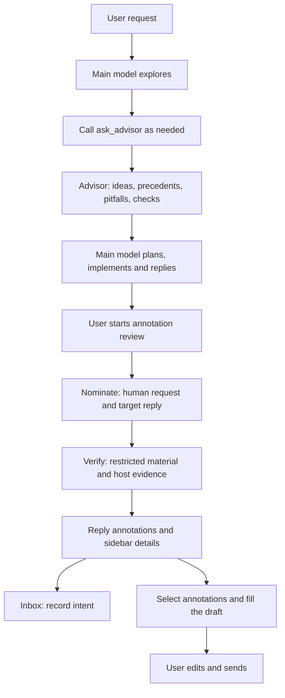

<!-- Generated from README.en.md by scripts/sync-docs.mjs; do not edit directly. -->

# dsh-ciel (Ciel)

<!-- ciel-doc: current -->

A planning advisor and annotation reviewer for [DeepSeek Harness](https://github.com/deepseek-ai/deepseek-harness) (DSH). The main model explores first and calls `ask_advisor` for ideas. A user can then request a two-stage restricted review of an assistant reply and decide what to do with its annotations.

Current release: **[0.20.0](https://github.com/higekibaka/dsh-ciel/releases/tag/v0.20.0)** · [npm](https://www.npmjs.com/package/dsh-ciel/v/0.20.0) · [Changelog](https://github.com/higekibaka/dsh-ciel/blob/main/CHANGELOG.md). Local release checks target **DSH 0.2.0-rc.2**; CI includes pinned 0.1.6, 0.1.7 and 0.2.0 targets.

This release includes **DSH 0.1.7-alpha.1** configuration and session compatibility. Read the [settings migration and validation notes](https://github.com/higekibaka/dsh-ciel/blob/main/docs/compatibility-017.md) before upgrading.

## Install and use

```sh
dsh plugin --profile web add dsh-ciel@0.20.0
```

Install or update in your intended profile, restart DSH and refresh the browser. In **Settings → 夏尔 Ciel**, select advisor and critic models already configured in DSH, then save. Default route names do not register providers or credentials for you.

1. The main model explores before calling `ask_advisor` as needed. The advisor supplies ideas, prior art, pitfalls and a verification checklist; the main model owns planning and implementation.
2. Click **批注评审** on an assistant reply. The default review nominates suspects, then verifies them against restricted material. Annotations appear on the reply and in the native right sidebar.
3. Open **夏尔收件箱** in the left sidebar to inspect the current session and mark annotations as undecided, planned or rejected. These marks record your intent only.
4. Select annotations in review details and choose **填入输入框**. Edit the resulting draft and send it yourself. An existing draft offers append, cancel or replace: append preserves text, references and attachments; replacement requires a second confirmation and replaces existing text and inline references. Inbox marks never run repairs or send messages.

The `/advise` command has been removed. Existing command and advice records are retained; advisor consultations use `ask_advisor`.

## Workflow


```mermaid
flowchart TD
    U[User request] --> E[Main model explores]
    E --> A[Call ask_advisor as needed]
    A --> I[Advisor: ideas, precedents, pitfalls, checks]
    I --> M[Main model plans, implements and replies]
    M --> C[User starts annotation review]
    C --> S[Nominate: human request and target reply]
    S --> V[Verify: restricted material and host evidence]
    V --> R[Reply annotations and sidebar details]
    R --> B[Inbox: record intent]
    R --> D[Select annotations and fill the draft]
    D --> F[User edits and sends]
```

The planning reminder and consultation gate share the same consultation state. Rejected admission does not consume a consultation slot. Reviews are user-triggered; history loading and progress recovery do not start model calls.

## What's new in 0.20.0

- Independent opt-in Jev evidence and advisor-context checks, with a shared secret API key, HTTPS endpoint and model configuration.
- Up to eight independent restricted investigators sharing one deadline, with per-item outcomes, blocked reasons and request counts.
- Bounded historical Host facts, original tool-output receipts and shallow directory evidence with explicit provenance.
- Native settings/review/evidence UI and confirmation-based draft insertion, retaining session and revision fencing.
- Original reads separated from evidence archival; pagination and coverage fixes, plus progress identity/cancellation repairs.
- Profile-backed settings, Session V4 compatibility and a pre-upgrade settings migration tool.

## Settings and draft interactions

Settings are explicitly saved; drafts survive section navigation and closing Settings within the same page, but not refresh/unload. The unsaved header and browser-exit warning do not intercept the Host settings close button. Read-only evidence remains distinct from current-file navigation; source links carry session identity. The earlier UI-only validation scope is recorded in [UI integration notes](https://github.com/higekibaka/dsh-ciel/blob/main/docs/ui-redesign-20260930.md), separately from the later Jev API fields.

## Inbox, drafts and history

The inbox lists the selected session only, with at most 25 reviews per page. Counts and filters apply to that page. Listing and intent updates never call a model or edit a draft. Reviews, historical evidence and advice open in the native right sidebar.

Inbox intent and the annotation selection used to prepare a draft are independent. Conflicting edits from another tab ask you to refresh and retry. If stored intent belongs to changed review content, the error remains explicit: no automatic reset or migration is provided. Multiple Hosts writing the same `DSH_HOME` are unsupported.

Reviews are associated with both session and message identity. Missing messages, unavailable evidence, failed loading and empty history have distinct states. Locating old annotations may require loading their message history. Opening the current file does not replace the saved historical evidence.

## Review scope and cost

The default review has two stages. Nomination sees the human request and target reply; verification adds restricted source snapshots and evidence references. Tool verification runs in Ciel's private worker + QuickJS/WASM and can access immutable review material only through controlled `read` / `grep` / `glob` queries. Missing guards or capabilities fail explicitly, without an unrestricted fallback.

One review may run per session. The default 180-second deadline includes preparation and both stages. Stop cancels active work; expiry does not add a writer or extend the deadline. Recoverable progress failures stop after at most four consecutive probes and offer an explicit sync retry; retrying progress does not rerun the review.

**A deadline is not a spending cap.** Both stages and continued generation after tools call a model, and providers may retry. Output limits apply to each response. Stopping cannot refund consumed tokens. Disabling `enabled` cancels active advisor/review operations and blocks new ones; disabling `criticExploreEnabled` only disables tool verification and still calls a model.

Zero annotations do not certify every claim. Unchecked items, truncated input, unavailable attachment content and failed stages remain visible in coverage. The host checks evidence membership, not the truth of the conclusion. The model sees what the program prints or returns, not necessarily every receipt the program could read.

## Configuration

The dedicated **夏尔 Ciel** settings page edits the `advisor` Profile entry on modern DSH (the legacy namespace is `ciel`). Save applies changes; navigating settings retains drafts, while refreshing does not save them. Revision checks prevent overwriting changes made elsewhere.

| Field | Default | Description |
|---|---|---|
| `provider` | `kimi-coding` | Advisor provider route (must be registered under Settings → Models) |
| `model` | `kimi-for-coding` | Advisor model id; cross-family diversity pays most |
| `reasoningEffort` | `provider` | Thinking depth pinned onto each advisor request; `provider` follows the provider default |
| `maxTokens` | `4096` | Advisor reply length cap (256–32768) |
| `maxCallsPerTurn` | `3` | Hard cap per agent turn (1–20), not a semantic planning-phase counter |
| `requireExploration` | `true` | First consultation requires a prior non-advisor tool call |
| `enforceFollowupGap` | `true` | Follow-ups require independent work in between |
| `planReminderEnabled` | `true` | One reminder when planning starts unconsulted |
| `guidanceEnabled` | `true` | Inject the consultation protocol into the system prompt |
| `criticProvider` | `google` | Critic provider route (independent of the advisor pipeline) |
| `criticModel` | `gemini-3.8-flash` | Critic model id |
| `criticEffort` | `medium` | Thinking depth pinned onto critic requests; `provider` also accepted |
| `enabled` | `true` | Allow Ciel model calls and feedback; turning off cancels its in-flight consultations/reviews |
| `advisorTimeoutSeconds` | `180` | Total deadline per `ask_advisor` consultation, 10–600 seconds |
| `criticExploreEnabled` | `true` | Enable restricted file verification after nomination; disabling still permits draft-only judgment |
| `jevApiKey` | unset | Secret field; official endpoint may fall back to `TYPESAFE_API_KEY` |
| `jevEndpoint` | `https://api.typesafe.ai/v1/systemone` | Complete HTTPS endpoint, not an OpenAI base URL |
| `jevModel` | `jev-1.13.0` | Shared Jev model ID |
| `jevEnabled` | `false` | Optional Jev evidence check; sends claims and cited source text to the configured service (TypeSafe by default) and reports disagreements without changing the main verdict |
| `advisorJevEnabled` | `false` | Independent advisor suggestion check against the supplied context, returned alongside the original advice |
| `criticTimeoutSeconds` | `180` | Sole review execution budget: one deadline for capture, nomination and verification, 10–600 seconds |
| `criticMaxTokens` | `16384` | Per-response size protection, 256–32768; nomination capped at 4096, not a request-count limit |
| `criticAdditionalRoots` | `[]` | Advanced: additional explicitly approved source directories |

The advanced `criticAdditionalRoots` setting defaults to `[]` and allows explicitly approved source directories. Legacy `criticExploreBudget` / `criticMaxRequests` values remain loadable but no longer limit request counts.

## Compatibility and data

Use **Settings → 夏尔 Ciel → 常用设置 → 启用 Jev 证据检查 → Save**. It is off by default. Use **Jev API 配置** to save an API key, complete HTTPS endpoint and model ID. A blank password input preserves the saved key; explicit clearing removes the profile override and re-inherits deployment settings. Only the default official endpoint falls back to `TYPESAFE_API_KEY`; custom endpoints require an explicitly configured key. Keys are stored in the local DSH configuration, not an encrypted vault, and are redacted on reads. Restart the Host once after updating the code and refresh the browser; later configuration saves apply to the next check without another restart. Keep file verification enabled. New review details show supports/contradicts/insufficient, disagreements, evidence links and API usage. Never put credentials in a model name or endpoint URL; use only the dedicated password field.

Enabling this sends exact draft claims and their cited source text to the configured service (TypeSafe by default) and incurs additional API usage. Each review makes at most one batch request with 8 claims and 24 KiB of state, capped at 10 seconds within the existing review deadline, with no retries. Oversized or unavailable evidence is skipped explicitly. Missing keys, API errors and timeouts preserve the main review. Saving the toggle off cancels pending Jev checks; historical reviews are not rerun.

Advisor checks have a separate, default-off switch: **常用设置 → 启用顾问建议检查（Jev） → Save**. After `ask_advisor` responds, Jev compares the original suggestions with the supplied question and context. The main model receives both the unchanged advice and the labeled results; saved advice details show them too. This checks consistency with unverified context, not independent factual accuracy. Insufficient support does not make a novel idea false.

This shares the Jev API configuration and sends the question, context and complete suggestion sections to the configured service (TypeSafe by default), with additional API usage. Each consultation allows one batch, up to 6 suggestions and 24 KiB of state, capped at 10 seconds within its existing deadline. Oversized or unstructured advice is explicitly skipped instead of clipped. Missing keys, API errors and check timeouts preserve the advisor answer. Saving this switch off cancels only the advisor Jev check; historical advice is never rerun.

- Local release checks use **DSH 0.2.0-rc.2**, with pinned CI targets for 0.1.6-alpha.2, 0.1.7-alpha.1 and 0.2.0-rc.2. Old hosts without secret metadata disable API editing; the official endpoint can still use an environment key.
- Node.js `^22.19.0` or `>=24.0.0`. Restricted file capture currently requires Linux and accessible procfs APIs; this does not restrict the browser UI to Linux.
- DSH supplies shared Cordis, Typert, `dsh-subagent`, `dsh-llm` and `dsh-tools` modules. Ciel is not a standalone Host. See [linked-development compatibility](https://github.com/higekibaka/dsh-ciel/blob/main/docs/compatibility-alpha2.md).
- Ciel uses DSH semantic theme variables. Isolated Web checks covered default and Endfield Glass light/dark modes, leaving the theme and unloading the plugin.
- Records live under `$DSH_HOME/ciel/v1/`, linked by session, kind and ID, with bounded reads and atomic writes. Legacy `dsh-advisor` JSONL history is neither read nor migrated; settings follow the separate [upgrade instructions](https://github.com/higekibaka/dsh-ciel/blob/main/docs/compatibility-017.md), not a record migration.
- Client caching keeps at most eight inactive sessions and approximately 16 MiB of result text; visible and in-flight sessions stay pinned. This is not a whole-browser memory bound and does not delete disk history.

See the [review contract](https://github.com/higekibaka/dsh-ciel/blob/main/docs/review-contract.md), [read isolation](https://github.com/higekibaka/dsh-ciel/blob/main/docs/read-isolation.md) and [capacity/recovery decisions](https://github.com/higekibaka/dsh-ciel/blob/main/docs/architecture-decisions.md) for full constraints.

## Development and validation

The root is a development package; `plugin/` is the published package. Sources in `plugin/src/` build into `plugin/client.js`.

```sh
pnpm install --frozen-lockfile
pnpm --dir plugin install --frozen-lockfile
pnpm check:docs
node scripts/build-client.mjs --check
node --test plugin/test/*.test.js

# Use an already-built DSH checkout; linking is for development copies only
DSH_CHECKOUT=/path/to/deepseek-harness node scripts/link-harness-peers.mjs
DSH_CHECKOUT=/path/to/deepseek-harness CIEL_VERIFY_NATIVE_PEERS=1 node scripts/verify-runtime.mjs
DSH_CHECKOUT=/path/to/deepseek-harness node scripts/verify-protocol.mjs
```

Release 0.20.0 passed **703 unit tests, 57 actual DSH offline-runtime scenarios and 22 native-sidebar checks**, plus native settings, Profile persistence/secret redaction/removal and migration checks. The release commit passed [three-version CI](https://github.com/higekibaka/dsh-ciel/actions/runs/37063769171); [publication](https://github.com/higekibaka/dsh-ciel/actions/runs/37064758406) succeeded. All 30 published npm files matched that release candidate byte-for-byte and carry provenance.

Daily-GUI online acceptance of the new Jev API fields remains unverified; offline checks did not restart the daily Host or make paid model requests. Earlier isolated Web checks have their own dates and scopes, not blanket acceptance of later features. See the [documentation index and validation boundaries](https://github.com/higekibaka/dsh-ciel/blob/main/docs/index.md). Web tests need a separate DSH_HOME, not merely a different port/profile.

Start further implementation from the [current architecture](https://github.com/higekibaka/dsh-ciel/blob/main/docs/architecture.md) and validate behavior against the [review contract](https://github.com/higekibaka/dsh-ciel/blob/main/docs/review-contract.md). Historical results belong in the [Changelog](https://github.com/higekibaka/dsh-ciel/blob/main/CHANGELOG.md); the [design notes](https://github.com/higekibaka/dsh-ciel/blob/main/docs/design.md) explain the motivation.

## License

[MIT](LICENSE)
